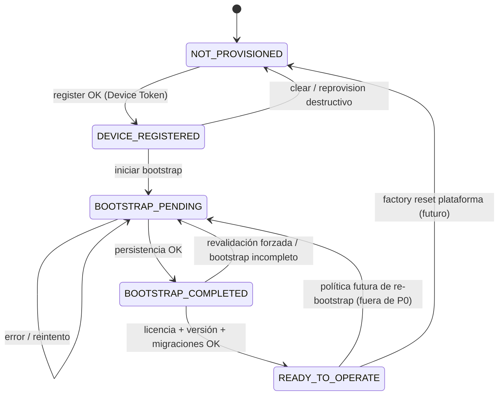
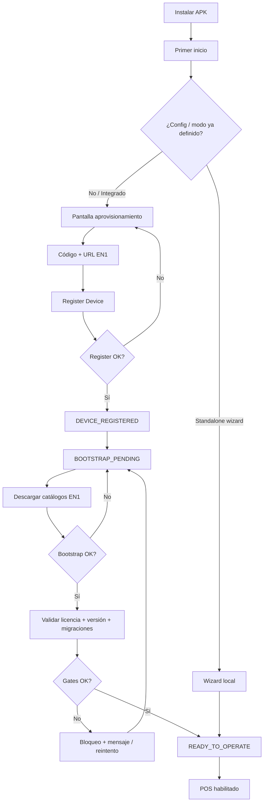

# ADR-014 — Instalación, aprovisionamiento y bootstrap (ciclo de vida del dispositivo)

| Campo | Valor |
|-------|--------|
| **Estado** | Aprobado — **gate APK implementado (1 ago 2026)**; delta contrato EN1 sigue diferido |
| **Fecha** | 1 de agosto de 2026 |
| **Dirigido a** | P2 / Local (EPosOne APK) · P1 / Codito (EN1, cuando congele contrato) · Producto |
| **Alcance de esta entrega** | Arquitectura + implementación del gate local (`READY_TO_OPERATE`). **Sin** cambios a contratos HTTP, DTOs ni endpoints (`installationMode` / `bootstrapRequired` siguen pendientes de P1). |
| **Relacionado** | EN1-02 provisioning · Hito 2 Device Bootstrap · [`ADR-007-EPOSONE-COMMERCIAL-LICENSING.md`](ADR-007-EPOSONE-COMMERCIAL-LICENSING.md) · [`EPOSONE_LICENSE_ENGINE_V1.md`](EPOSONE_LICENSE_ENGINE_V1.md) · [`EPOSONE_EN1_HITO1_PROVISIONING_CONTRACT_EN1-02.md`](EPOSONE_EN1_HITO1_PROVISIONING_CONTRACT_EN1-02.md) |

---

## 1. Contexto

Durante la revisión del roadmap P0 se decidió **detener desarrollo nuevo** y estabilizar el producto para el primer cliente.

Al analizar la instalación se detectó que el onboarding actual (wizard de bienvenida que elige Local vs Plataforma) puede simplificarse y dejar reglas de negocio más claras para el modo **Integrado con EN1**.

Esta ADR fija la **arquitectura objetivo** del ciclo de vida desde el primer arranque hasta que el POS queda habilitado. La implementación en APK y cualquier delta de contrato EN1 quedan **bloqueados** hasta que Prog1 congele el contrato (si aplica) y Producto/Local den **GO** de código.

### 1.1 Situación actual (APK — referencia, no objetivo final)

Hoy la APK:

- Expone `PlatformMode` (`local` | `platform` | `undecided`) vía wizard de bienvenida.
- Tras provisioning exitoso marca `platform` y permite continuar a onboarding/PIN según setup local + cajeros.
- Ejecuta bootstrap EN1, pero **no hay gate duro** que impida PIN / abrir caja / vender si el bootstrap no completó.
- Standalone usa wizard local sin register EN1.

El gap principal vs esta ADR: **falta máquina de estados + gate obligatorio post-provisioning en modo integrado**.

---

## 2. Principios aprobados

1. **Una sola APK.** No habrá APK Local ni APK EN1. La misma aplicación soporta ambos escenarios.
2. **Dos modos de operación:** `standalone` | `integrated` (en código actual: `PlatformMode.local` | `PlatformMode.platform`; nombres canónicos de producto abajo).
3. **Integrado** significa: el dispositivo pertenece a una organización administrada desde EN1. Organización, sucursal, caja, cajeros, configuración, licencia y parámetros **provienen de EN1**. La APK **no inventa** esos datos.
4. **Bootstrap obligatorio** en modo integrado: tras provisioning, no se opera hasta bootstrap exitoso.
5. **Standalone (por ahora) no cambia:** wizard actual, sin dependencia de EN1, sin provisioning, sin bootstrap remoto.
6. **Contrato HTTP:** no inventar ni consumir aún campos tipo `installationMode` / `bootstrapRequired` hasta handoff congelado de P1.

---

## 3. Decisión

### 3.1 Ciclo de vida — modo Integrado

```text
Instalar APK
      ↓
Primer inicio
      ↓
Modo Integrado (vía flujo de aprovisionamiento)
      ↓
Introducir código de aprovisionamiento (+ URL EN1 según contrato vigente)
      ↓
Register Device
      ↓
Obtener Device Token
      ↓
Bootstrap obligatorio
      ↓
Descargar (según contrato bootstrap vigente / futuro):
  Empresa · Sucursal · Caja · Cajeros · Productos · Categorías
  Impuestos · Métodos de pago · Configuración · Permisos
  Licencia · Parámetros POS · Versiones / numeraciones
      ↓
Validar licencia
      ↓
Validar versión mínima APK (si el contrato lo define)
      ↓
Migraciones locales
      ↓
Bootstrap OK → estado READY_TO_OPERATE
      ↓
POS habilitado
```

Hasta `READY_TO_OPERATE`, el POS permanece **bloqueado**.

### 3.2 Ciclo de vida — modo Standalone (sin cambio funcional ahora)

```text
Instalar APK
      ↓
Wizard local (empresa / sucursal / caja / cajeros / config)
      ↓
READY_TO_OPERATE (criterio local: setup completo + cajeros)
      ↓
POS habilitado
```

No depende de EN1. No requiere provisioning. No requiere bootstrap remoto.

### 3.3 Gate obligatorio (modo integrado / plataforma)

Si el dispositivo está en modo plataforma/integrado y el bootstrap está incompleto:

| Acción | Permitida |
|--------|-----------|
| Abrir caja / turno | No |
| Iniciar sesión (PIN operativo) | No |
| Vender | No |
| Crear pedidos | No |
| Entrar al POS | No |

**No debe existir bypass** (ni debug flag de producto, ni “continuar offline” en el primer bootstrap).

> Nota Offline First ([ADR-007](ADR-007-EPOSONE-COMMERCIAL-LICENSING.md)): aplica **después** del primer bootstrap exitoso. El primer contacto con datos oficiales EN1 es obligatorio; el offline protege la operación cotidiana posterior, no el alta inicial integrada.

### 3.4 Fuente del modo (arquitectura objetivo)

- **Integrado:** se entra por código de aprovisionamiento + register exitoso (contrato EN1-02 vigente hoy; posibles campos descriptores en un delta futuro de P1).
- **Standalone:** wizard local (sin EN1), **sin cambio en esta fase**.
- La APK **no debe “adivinar”** el modo en runtime más allá de lo persistido tras el flujo elegido; el objetivo a medio plazo es que el descriptor de instalación (cuando P1 lo congele) refuerce el modo sin UI ambigua.

**Fuera de alcance de implementación ahora:** cambiar el contrato register para emitir `installationMode`, códigos standalone vía EN1, etc.

---

## 4. Máquina de estados (dispositivo)

Estados canónicos a persistir localmente (prefs / store de plataforma; detalle de persistencia en implementación futura):

| Estado | Significado |
|--------|-------------|
| `NOT_PROVISIONED` | Sin Device Token / sin register completo. Primer arranque o reset de plataforma. |
| `DEVICE_REGISTERED` | Register OK; Device Token y jerarquía básica persistidos; bootstrap aún no iniciado o fallido antes de completar. |
| `BOOTSTRAP_PENDING` | Bootstrap en curso o reintento obligatorio pendiente. |
| `BOOTSTRAP_COMPLETED` | Catálogos/config/licencia del bootstrap aplicados y validados localmente. |
| `READY_TO_OPERATE` | Cumple gates de negocio (bootstrap OK + licencia operable + versión OK + migraciones). **Único estado que habilita el POS en modo integrado.** |

### 4.1 Transiciones (modo integrado)



### 4.2 Regla de operación

```text
POS puede operar  ⇔  installationLifecycleState == READY_TO_OPERATE
```

En modo **standalone**, el mapeo equivalente se alcanza por el wizard local (sin pasar por `DEVICE_REGISTERED` / bootstrap remoto). El nombre de estado puede reutilizarse o mapearse a un camino local; implementación futura no debe mezclar gates EN1 en standalone.

---

## 5. Diagrama de flujo (primer inicio)



---

## 6. Reglas de negocio

1. **Una APK, dos modos.** El binario no bifurca por canal de distribución.
2. **Integrado = SoT EN1** para org, sucursal, caja, cajeros, config, licencia y parámetros de plataforma.
3. **Tras register, bootstrap es obligatorio** antes de cualquier operación de caja/POS.
4. **Sin bypass** del gate de primer bootstrap en modo integrado.
5. **Standalone no cambia** en esta ADR (wizard actual).
6. **Licencia:** se valida como parte del camino a `READY_TO_OPERATE` (payload bootstrap / License Engine V1). No inventar Trial local en modo integrado ([ADR-007](ADR-007-EPOSONE-COMMERCIAL-LICENSING.md), License Engine).
7. **Versión mínima:** si EN1 declara versión mínima soportada (cuando el contrato lo incluya), fallar el gate con mensaje claro; no operar.
8. **Reprovision:** rota token según EN1-02; tras reprovision, el dispositivo vuelve a exigir bootstrap hasta `READY_TO_OPERATE` (detalle táctico en implementación).
9. **No modificar contratos HTTP** en P2 hasta handoff P1 congelado.
10. **Offline First** aplica solo **después** de `READY_TO_OPERATE`.

---

## 7. Impacto sobre Startup

| Aspecto | Hoy | Objetivo (post-GO implementación) |
|---------|-----|-----------------------------------|
| Rutas | `platformWelcome` → `onboarding` \| `pin` | Insertar ruta/pantalla de **bootstrap bloqueante** si modo integrado y estado ≠ `READY_TO_OPERATE` |
| Criterio PIN | setup local + cajeros | En integrado: además (y prioritario) lifecycle = `READY_TO_OPERATE` |
| Provisioned shortcut | Si hay token, marca `platform` y puede ir a onboarding/PIN | Si hay token pero bootstrap incompleto → **no PIN/POS**; solo UI de bootstrap/reintento |
| Standalone | Wizard welcome + onboarding | Sin cambio de principio |

Archivo de referencia actual: `eposone/lib/src/core/startup/app_startup.dart`.

---

## 8. Impacto sobre Bootstrap

| Aspecto | Hoy | Objetivo |
|---------|-----|----------|
| Ejecución | Bajo demanda / sync / pantallas | **Automática y bloqueante** tras `DEVICE_REGISTERED` |
| Fallo | Usuario puede seguir en algunos flujos | Permanecer en `BOOTSTRAP_PENDING`; UI de error + reintento |
| Éxito | Flags prefs (`en1_bootstrap_done_v1`, etc.) | Transición explícita → `BOOTSTRAP_COMPLETED` → gates → `READY_TO_OPERATE` |
| Contenido | Contrato Hito 2 vigente | Seguir contrato congelado; no inventar bloques nuevos en cliente |

No cambiar endpoints ni DTOs en esta fase.

---

## 9. Impacto sobre Licencias

| Aspecto | Hoy | Objetivo |
|---------|-----|----------|
| Origen integrado | Opcional en bootstrap (`license`) | **Gate** hacia `READY_TO_OPERATE`: sin licencia operable (o grace no aplicable en primer bootstrap) → no POS |
| FeatureManager | Motor local existe; gating POS parcial | Alinear: capacidades post-`READY_TO_OPERATE` según snapshot de licencia EN1 |
| Standalone | Política local / comercial engine | Sin cambio forzado por esta ADR |
| Relación ADR-007 | Grace offline post-validación | Grace **no** sustituye el primer bootstrap |

---

## 10. Impacto sobre Sync

| Aspecto | Hoy | Objetivo |
|---------|-----|----------|
| Primer contacto | Sync/bootstrap mezclables en UX | **Bootstrap = primer sync de lectura canónica**; sync operativo (upload pedidos, cash shift, pull incremental) solo con dispositivo `READY_TO_OPERATE` |
| `isEn1SyncReady` | URL + token + branch + flag sync | Debe implicar (o subordinarse a) lifecycle `READY_TO_OPERATE` en modo integrado |
| Cola offline | Puede encolar antes de datos oficiales | En integrado, no crear pedidos/turnos hasta ready; la cola post-ready sigue Offline First |
| Sync-first en cada venta | No | No bloquear ventas cotidianas por sync; el bloqueo es **solo** el primer bootstrap |

---

## 11. Fuera de alcance (explícito — no hacer aún)

- Modificar contratos HTTP, DTOs, endpoints.
- Introducir en cliente campos `installationMode`, `bootstrapRequired` u otros no congelados.
- Emitir códigos de aprovisionamiento standalone desde EN1.
- Eliminar o reescribir el wizard standalone.
- Implementar la máquina de estados en Dart.
- Nuevas features de producto ajenas a estabilización P0.

---

## 12. Entregables de esta instrucción

| Entregable | Estado |
|------------|--------|
| ADR de instalación (este documento) | Hecho |
| Diagrama de flujo | §5 |
| Máquina de estados | §4 |
| Reglas de negocio | §6 |
| Impacto Startup / Bootstrap / Licencias / Sync | §7–§10 |
| Gate APK (`InstallationLifecycle` + `/platform/bootstrap`) | **Hecho** (1 ago 2026) |
| Delta contrato EN1 (campos instalación genéricos) | **No** (pendiente P1 / handoff) |
| Delta contrato **APK update / OTA** | **Borrador Local** → [`EPOSONE_EN1_APK_UPDATE_CONTRACT_DELTA_REQUEST.md`](EPOSONE_EN1_APK_UPDATE_CONTRACT_DELTA_REQUEST.md) · cliente [`EPOSONE_EN1_APK_UPDATE_CLIENT_SPEC_V1.md`](EPOSONE_EN1_APK_UPDATE_CLIENT_SPEC_V1.md) · **sin código hasta freeze** |

---

## 13. Criterios para GO de implementación (P2)

1. Producto confirma que el gate duro no rompe el piloto del primer cliente (o se acuerda ventana de migración).
2. Si se requieren campos nuevos en register/bootstrap → handoff P1 congelado en `Doc/`.
3. GO explícito de Local para tocar `app_startup`, bootstrap repo y gates de PIN/caja/POS.
4. Plan de prueba: provisionar → fallar bootstrap a propósito → verificar bloqueo → bootstrap OK → verificar POS.

---

## 14. Resumen ejecutivo

**Decisión:** en modo integrado, el dispositivo solo opera en `READY_TO_OPERATE` tras register + bootstrap obligatorio + validación de licencia/versión; sin bypass.

**Standalone:** sin cambio ahora.

**Implementación:** diferida. Esta ADR alinea arquitectura y prepara el cambio cuando el contrato EN1 y el GO de código lo permitan.
