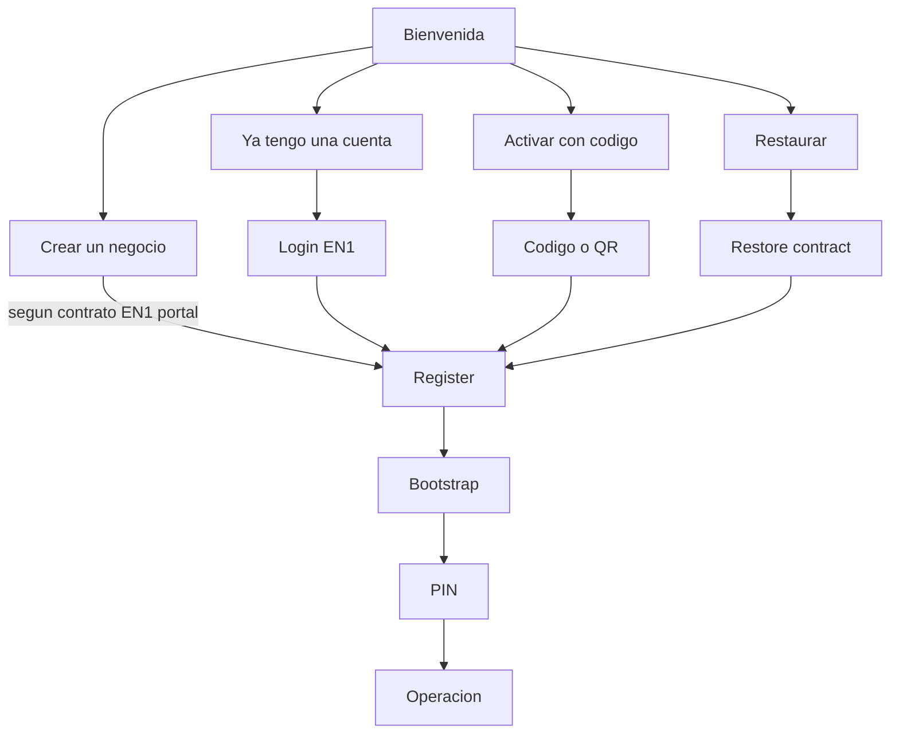

# LOCAL — P0 Onboarding nuevo (plan de implementación)

| Campo | Valor |
|-------|--------|
| **Fecha** | 6 ago 2026 |
| **Estado** | **BLOQUEADO** — no iniciar desarrollo hasta GO CODITO + contratos congelados |
| **Rol** | LOCAL (EP1 / APK) |
| **As-is** | [`EPOSONE_PROVISIONING_UX_REVIEW_V1.md`](EPOSONE_PROVISIONING_UX_REVIEW_V1.md) |
| **Respuesta Plan Maestro** | [`EPOSONE_ONBOARDING_MASTER_PLAN_LOCAL_RESPONSE_V1.md`](EPOSONE_ONBOARDING_MASTER_PLAN_LOCAL_RESPONSE_V1.md) |
| **ADR vigente** | [`ADR-014`](ADR-014-EPOSONE-INSTALLATION-PROVISIONING-BOOTSTRAP.md) — se actualizará cuando CODITO congele Device Lifecycle |

---

## Gate de entrada (obligatorio)

**No escribir código de onboarding nuevo** hasta que CODITO entregue y Producto apruebe:

| # | Entrega CODITO |
|---|----------------|
| 1 | Contrato único de onboarding / device lifecycle aprobado |
| 2 | ADR EN1 / Device Lifecycle actualizado |
| 3 | Login EN1 (admin) formalizado (endpoints, scopes, sesión) |
| 4 | Restore formalizado (org → POS → re-vínculo) |
| 5 | QR técnico formalizado (payload: URL, token/código, versión) |
| 6 | Modalidad Standalone vs Connected expuesta a la APK (campo/config) |
| 7 | Gates de implementación aprobados (GO explícito a LOCAL) |

Sin ese paquete, LOCAL mantiene el flujo actual (Welcome Local/Plataforma + Connect código).

---

## Objetivo

Un solo onboarding oficial en la APK:

```text
Bienvenida (4 caminos)
        │
        ▼
Register → Bootstrap → (Config si contrato) → PIN → Operación
```

- Una sola APK.  
- Cuatro caminos oficiales.  
- Todos convergen al pipeline existente.  
- Sin UI de “Modo Local / Cloud / Online / Offline”.  
- Standalone vs Connected = **configuración recibida de EN1**, no elección del usuario en welcome.

---

## Fases (orden de trabajo tras GO)

### Fase 1 — Eliminar “Modo Local” visual

Pantalla inicial **solo**:

| Acción UI | Camino |
|-----------|--------|
| Crear un negocio | → Portal/EN1 o deep link (según contrato; APK puede abrir URL) |
| Ya tengo una cuenta | → Login EN1 (Fase 5) |
| Activar con código | → Código / pegar / QR (Fase 6) |
| Restaurar instalación | → Restore (Fase 4) |

**Retirar** de welcome: Local vs Plataforma, Cloud/Local, Online/Offline.

### Fase 2 — Reutilizar pipeline (no crear otro flujo)

```text
Register → Bootstrap → Configuración → PIN → Operación
```

Orquestación existente:

- `En1ProvisioningRepository` / `POST …/devices/register`
- `En1BootstrapRepository` / `GET …/devices/bootstrap`
- `InstallationLifecycle` (ADR-014 gate)
- `PinScreen` → `CashOpen` → `Pos`

### Fase 3 — Nueva bienvenida

- Más simple, menos decisiones, guiada.  
- Modalidad la decide EN1 (post-register/config/bootstrap).  
- Copy alineado a Manual Oficial.

### Fase 4 — Restore

```text
Login → Seleccionar Organización → Seleccionar POS → Bootstrap → Listo
```

Solo según contrato CODITO. Mapear a register/re-bind + bootstrap; **no** inventar restore local.

### Fase 5 — Login EN1

- No autenticar “contra la app” con credenciales inventadas.  
- Consumir **únicamente** el contrato CODITO (tokens/scopes definidos allí).  
- Tras login: datos para elegir org/POS o emitir provisioning → Register → Bootstrap.

### Fase 6 — Código de aprovisionamiento

Mantener mecanismo actual (`X-EN1-Provisioning-Code` + register).

Agregar UX:

- Copiar código (desde EN1/portal — si aplica en APK, clipboard).  
- Pegar código.  
- Escanear QR (payload del contrato).

Todos terminan en **Register → Bootstrap**.

### Fase 7 — PIN (sin caminos alternos)

Tras Bootstrap:

```text
Descargar cajeros → Seleccionar cajero → PIN → Inicio (caja/POS)
```

- Eliminar caída a onboarding local post-bootstrap (`isSetupComplete` gap).  
- Un solo camino a operación.

### Fase 8 — No modificar (solo consumir nuevo contrato)

| Dominio | Regla |
|---------|--------|
| Bootstrap | Sin reescritura de lógica de dominio |
| Register | Sin reescritura; solo inputs/UX nuevos |
| Cashiers | Sin cambio de modelo |
| Sync | Sin cambio |
| Licenciamiento | Sin cambio de motor |
| Eventos | Sin cambio |
| Offline | Sin cambio |
| Re-Provision | Mantener; alinear a nuevos caminos si el contrato lo pide |

---

## Criterios de aceptación LOCAL

| # | Criterio |
|---|----------|
| 1 | Una sola APK |
| 2 | Un solo onboarding |
| 3 | Cuatro caminos oficiales (Crear negocio / Ya tengo cuenta / Código / Restaurar) |
| 4 | Todos convergen: Register → Bootstrap → PIN → Operación |
| 5 | Cero referencias UX al antiguo “Modo Local” |
| 6 | Standalone y Connected vía config EN1 (no toggle en welcome) |
| 7 | Sin endpoints inventados; solo contratos CODITO |
| 8 | Suite/manual de instalación actualizado al flujo único |

## Criterios CODITO (pre-requisito)

Contrato único · ADR · Device Lifecycle · Login · Restore · QR · Gates GO.

---

## Mapa caminos → pipeline



---

## Fuera de alcance de este P0 LOCAL

- Implementar Runtime/Gateway EasyAI.  
- Inventar HTTP Login/Restore/QR.  
- Cambiar motor de sync, licencia o Order Domain.  
- Google Play como canal (sigue OTA EN1 cuando P1 congele).

---

## Señal de arranque

Cuando exista en este repo (o handoff explícito):

1. Paquete contractual CODITO (paths en `Doc/`).  
2. Mensaje **GO LOCAL Onboarding P0**.

Entonces ejecutar Fases 1→7 en orden, con commits por fase y sin tocar Fase 8 de dominio.
