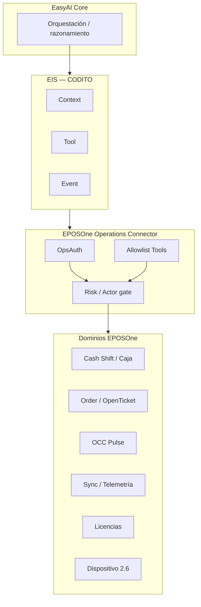
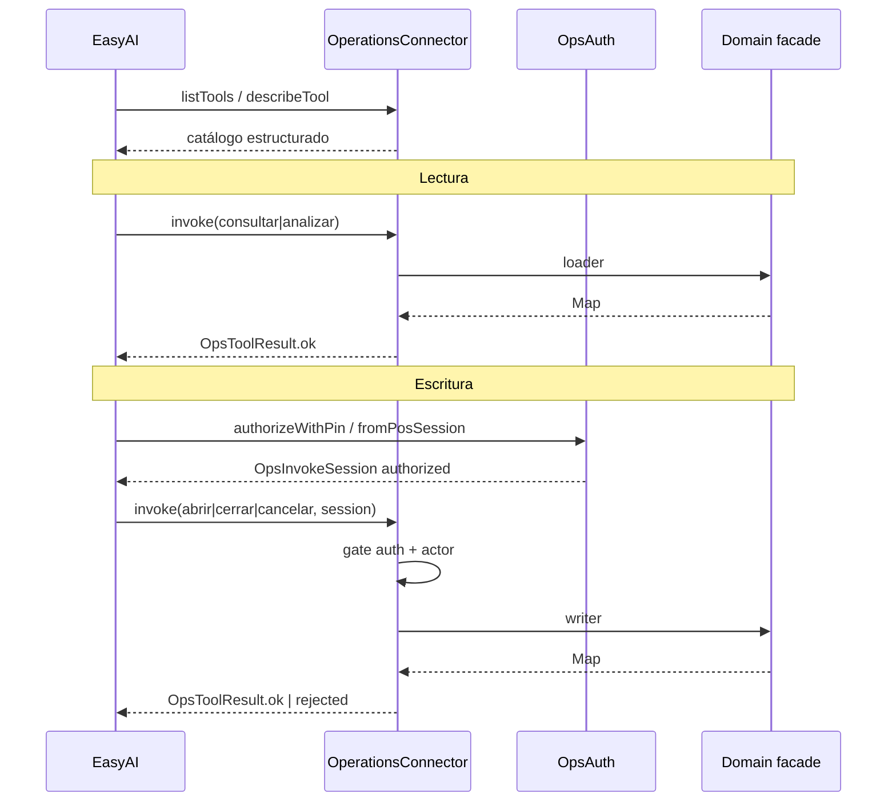
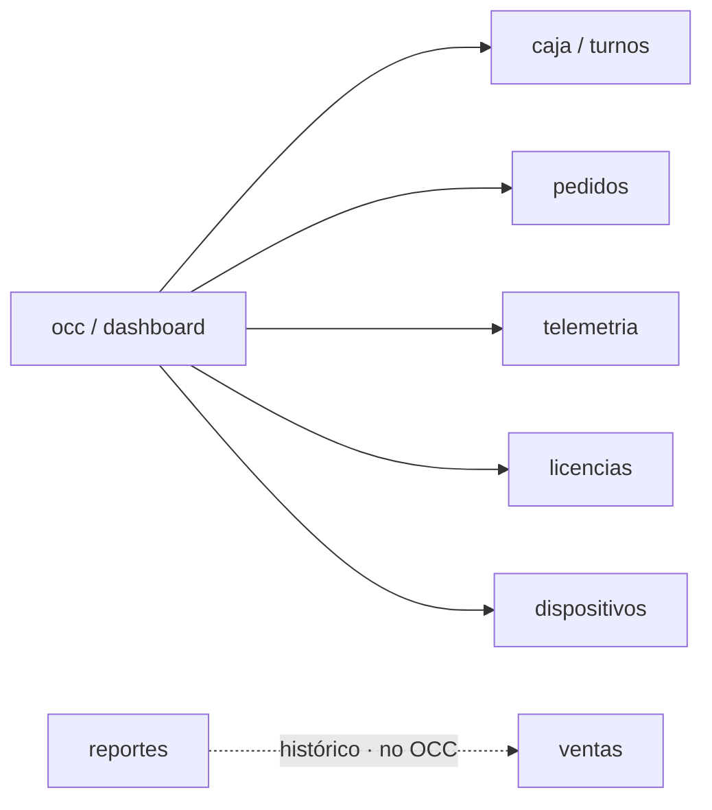
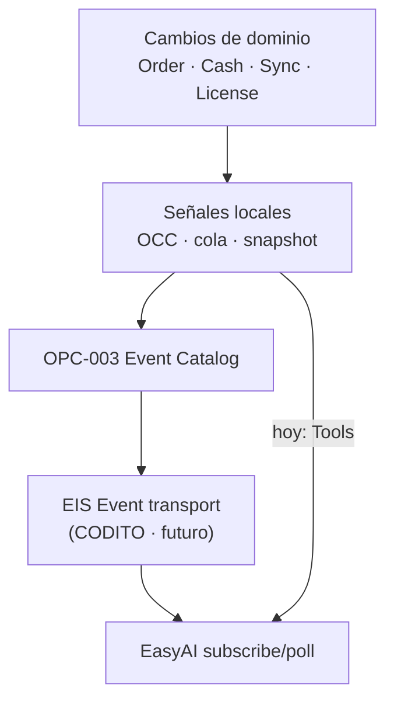
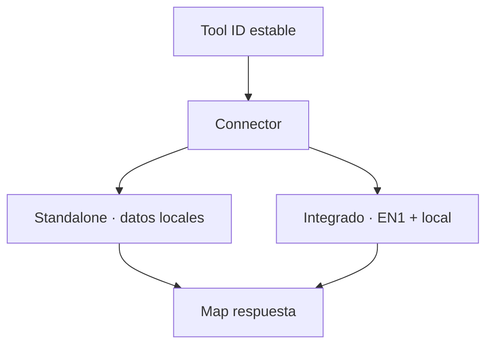

# OPC — Diagramas (S2)

| Campo | Valor |
|-------|--------|
| **Padre** | [OPC-000](OPC-000-EPOSONE-OPERATIONS-CONNECTOR.md) |
| **Fecha** | 5 ago 2026 |

---

## 1. Contexto EasyAI ↔ EPOSOne (EIS)

---

## 2. Flujo invoke (lectura vs escritura)

---

## 3. Contextos y observación OCC

---

## 4. Eventos (diccionario → futuro EIS)

---

## 5. Dual Mode (oculto al tool)

