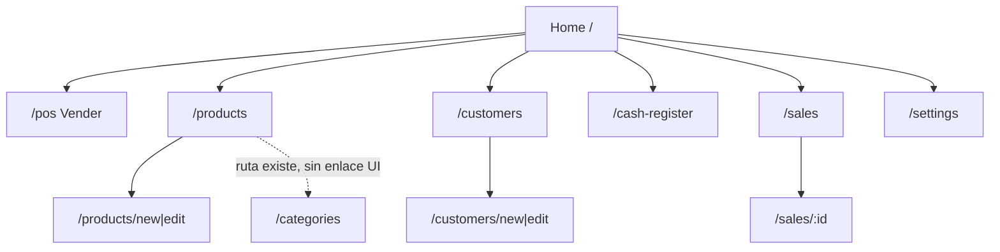
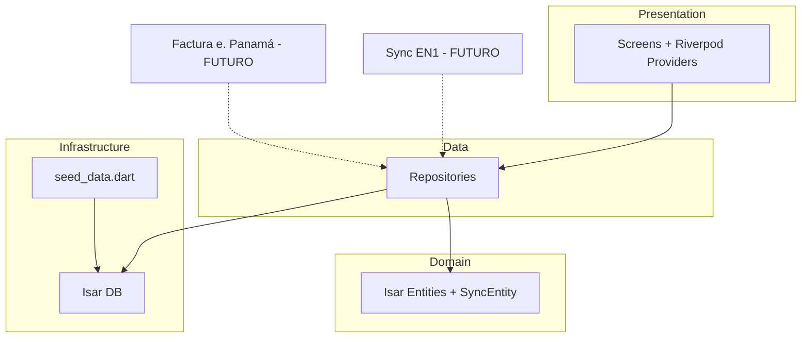

# EPOSOne — Revisión de Arquitectura y Auditoría Técnica

**Fecha:** 10 de junio de 2026  
**Alcance:** Auditoría de solo lectura (sin modificaciones de código)  
**Repositorio:** `EPosOne/` — aplicación Flutter en `eposone/`

---

## Guía obligatoria para programadores IA (Cursor, Cline, Claude, etc.)

Antes de leer archivos individuales en `lib/`, construir el mapa del proyecto leyendo en este orden:

1. `eposone/pubspec.yaml` — dependencias, SDK, plataformas implícitas  
2. `eposone/README.md` — arquitectura documentada, stack, funcionalidades declaradas  
3. Estructura de carpetas (`eposone/lib/`, `android/`, `windows/`)  
4. Solo después: módulos en `lib/src/features/` y `lib/src/core/`

**No existe:** carpeta `.github/`, `docs/`, `ios/`, `web/`, `assets/`, `lib/src/widgets/` (aunque el README las menciona).

**Reglas de trabajo:** no modificar código, no instalar dependencias, no ejecutar migraciones, no hacer commits hasta que el usuario apruebe el plan tras esta auditoría.

---

## Resumen ejecutivo

EPOSOne (`eposone`) es un **POS offline-first para Android** orientado a pequeños negocios en Panamá. Usa **Flutter + Riverpod + GoRouter + Isar**. La base arquitectónica es sólida (feature-first, repositorios, entidades con `SyncEntity` preparadas para sync futuro), pero el producto está en **estado MVP incompleto**: el flujo de venta en POS **no persiste ventas en base de datos**, la pantalla de configuración es un placeholder, y varias dependencias declaradas no se usan.

| Aspecto | Estado |
|---------|--------|
| Arquitectura base | Buena — lista para crecer |
| MVP POS funcional end-to-end | **Roto** — checkout simulado |
| Inventario / catálogo | Parcial — CRUD local OK, sin descuento de stock al vender |
| Facturación / recibos | Parcial — modelo y repo existen; sin PDF/impresión en UI |
| Sync / multiempresa / SaaS | No implementado (solo preparación en entidades) |
| Publicación stores | No listo — `com.example.eposone`, firma debug en release |

**Veredicto:** Proyecto ~60–70 % de scaffolding útil, ~30–40 % de integración crítica pendiente antes de un MVP POS real en producción.

---

## Fase 1 — Inventario

### Árbol resumido del proyecto

```
EPosOne/                          ← raíz git
├── EPOSONE_ARCHITECTURE_REVIEW.md
├── Dashboard.txt                 ⚠ contiene credenciales expuestas
├── Trabajo y Readme.txt          → apunta a eposone/README.md
├── cmdline-tools/                ← Android SDK tools (no es parte de la app)
└── eposone/                      ← APP FLUTTER PRINCIPAL
    ├── pubspec.yaml
    ├── README.md
    ├── analysis_options.yaml
    ├── lib/
    │   ├── main.dart
    │   └── src/
    │       ├── app.dart
    │       ├── core/
    │       │   ├── database/     (Isar + seed)
    │       │   ├── entities/     (SyncEntity)
    │       │   └── router/       (GoRouter)
    │       └── features/
    │           ├── cash_register/
    │           ├── customers/
    │           ├── home/
    │           ├── pos/
    │           ├── products/
    │           ├── sales/
    │           └── settings/
    ├── android/                  ← plataforma principal
    ├── windows/                  ← scaffold Flutter (no objetivo del README)
    └── test/
        └── widget_test.dart
```

### Framework y versiones

| Elemento | Valor |
|----------|-------|
| Framework | **Flutter** (Material 3) |
| Dart SDK | `>=3.0.0 <4.0.0` (pubspec) |
| Flutter (README) | 3.27.0 documentado |
| Flutter (pubspec.lock constraint) | `>=3.44.0` |
| Flutter (`.metadata` revision) | stable `924134a44c…` |
| App version | `1.0.0+1` |

### Arquitectura

**Feature-first + capas ligeras por módulo:**

```
presentation/  → screens, providers (Riverpod)
data/          → repositories (acceso Isar)
domain/        → entities (@collection Isar)
core/          → router, DB, SyncEntity base
```

No hay capa de servicios HTTP ni módulo de sync. Estado con **Riverpod** (mix de `@riverpod` codegen y providers manuales).

### Dependencias importantes

| Paquete | Versión | Uso real |
|---------|---------|----------|
| go_router | ^14.0.0 | Navegación — **usado** |
| flutter_riverpod | ^2.5.0 | Estado — **usado** |
| riverpod_annotation / generator | ^2.3 / ^2.4 | DB + repos — **usado** |
| isar / isar_flutter_libs | ^3.1.0+1 | BD local — **usado** |
| pdf / printing | ^3.10 / ^5.12 | **No referenciado en lib/** |
| share_plus / url_launcher | ^9.0 / ^6.2 | **No usado** |
| intl | ^0.19.0 | Fechas en ventas — **usado** |
| uuid | ^4.0.0 | **No usado** (IDs = timestamp) |
| freezed / json_annotation | dev | **No usado** (copyWith manual) |
| flutter_slidable | ^3.1.0 | Listas productos/clientes/categorías — **usado** |
| dropdown_search | ^5.0.0 | **No usado** (DropdownButton nativo) |

### Configuración por plataforma

| Plataforma | Estado |
|------------|--------|
| **Android** | Principal. `applicationId`: `com.example.eposone`. Manifest mínimo, sin permisos BT/cámara/almacenamiento extra. Release firmado con debug keys. |
| **iOS** | **No existe** carpeta `ios/` |
| **Web** | **No existe** carpeta `web/` |
| **Desktop (Windows)** | Scaffold presente (`windows/`), plugins Isar/path_provider registrados; no documentado como target |
| **Firebase** | **No configurado** (sin `firebase_*`, sin `google-services.json`) |
| **APIs externas** | **Ninguna** en código. Sync EN1 / factura electrónica Panamá: no implementados |

---

## Fase 2 — Arquitectura

### Entrypoint principal

```
main.dart → ProviderScope → EPosOneApp (app.dart) → MaterialApp.router → appRouterProvider
```

### Navegación (GoRouter)

| Ruta | Pantalla |
|------|----------|
| `/` | HomeScreen (dashboard grid) |
| `/pos` | PosScreen |
| `/products`, `/products/new`, `/products/:id/edit` | ProductList / ProductForm |
| `/categories` | CategoryListScreen |
| `/customers`, `/customers/new`, `/customers/:id/edit` | CustomerList / CustomerForm |
| `/cash-register` | CashRegisterScreen |
| `/sales`, `/sales/:id` | SalesHistory / SaleDetail |
| `/settings` | SettingsScreen (placeholder) |

**Flujo principal:**



### Gestión de estado (Riverpod)

| Provider | Módulo | Rol |
|----------|--------|-----|
| `databaseProvider` | core | Isar singleton + seed |
| `appRouterProvider` | core | GoRouter |
| `cartProvider`, `checkoutProvider`, `posSaleProvider` | pos | Carrito y venta |
| `product*Provider`, `category*Provider` | products | CRUD catálogo |
| `customer*Provider` | customers | CRUD clientes |
| `cashRegister*Provider` | cash_register | Apertura/cierre caja |
| `sales*Provider` | sales | Historial y anulación |
| `businessConfigRepository` | settings | Config en BD |
| `businessConfigProvider` (pos) | pos | **Stub — siempre null** |

### Modelos (Isar @collection)

- `Product`, `Category`, `Customer`, `Sale`, `SaleItem`, `CashRegister`, `BusinessConfig`
- Base abstracta: `SyncEntity` + enum `SyncStatus`

### Repositorios

| Repositorio | Operaciones clave |
|-------------|-------------------|
| `ProductRepository` | CRUD, búsqueda, barcode, `updateStock` |
| `SaleRepository` | saveSale, cancelSale, totales por caja |
| `CustomerRepository` | CRUD clientes |
| `CashRegisterRepository` | open/close, historial |
| `BusinessConfigRepository` | singleton config, correlativo recibos |

### Pantallas vs widgets reutilizables

- **14 pantallas** bajo `features/*/presentation/screens/`
- **No hay** carpeta `lib/src/widgets/` — widgets privados inline (`_MenuCard`, `_ProductCard`, etc.)
- `CategoryListScreen`: ruta registrada pero **sin navegación desde UI** (pantalla huérfana)

### Dependencias entre módulos

```
core/database ──► todos los repositories
products ──► pos (Product en carrito)
sales ◄── pos (debería; hoy desconectado)
settings/business_config ◄── pos (stub; debería usar repository)
cash_register ◄── sales (cashRegisterId en Sale; no asignado al vender)
```

---

## Fase 3 — Funcionalidades

| Funcionalidad | Estado | Evidencia |
|---------------|--------|-----------|
| **POS** | **Parcial** | UI completa (catálogo, carrito, checkout). `_completeSale` no llama `posSaleProvider`; solo limpia carrito y muestra diálogo |
| **Inventario** | **Parcial** | Stock en entidad, alertas en UI, `updateStock` en repo; no se descuenta al vender |
| **Clientes** | **Implementada** | CRUD local funcional |
| **Facturación** | **Parcial** | Modelo Sale + correlativo en BusinessConfig; sin emisión PDF/ticket |
| **Pagos** | **Parcial** | Efectivo/tarjeta/transfer en UI; sin integración pasarela |
| **Usuarios** | **No implementada** | Sin auth, roles ni login |
| **Sincronización** | **No implementada** | `SyncEntity`/`SyncStatus` en modelos; sin servicio sync |
| **Offline** | **Implementada** | Isar local + seed; app funciona sin red |
| **Impresión** | **No implementada** | Deps `pdf`/`printing` sin uso |
| **Bluetooth** | **No implementada** | Sin deps ni permisos |
| **Escáner** | **No implementada** | Campo barcode en productos; `getProductByBarcode` sin uso en POS |
| **Factura electrónica Panamá** | **No implementada** | Sin DGI/FECF |
| **Reportes** | **No implementada** | Solo historial de ventas y resumen básico en caja |

### Módulos adicionales presentes

| Módulo | Estado |
|--------|--------|
| Caja registradora | **Implementada** (apertura/cierre local) |
| Categorías | **Parcial** (CRUD OK, pantalla huérfana en nav) |
| Configuración negocio | **No implementada** (placeholder UI; datos solo en seed) |
| Historial ventas | **Parcial** (lista/anulación OK; sin ventas nuevas desde POS) |

---

## Fase 4 — Calidad técnica

### Crítico

1. **POS no persiste ventas** — `pos_screen.dart` `_completeSale` tiene comentario explícito y no invoca `posSaleProvider` / `SaleRepository.saveSale`.
2. **Credenciales en repositorio** — `Dashboard.txt` en raíz contiene API keys en texto plano. Rotar keys y eliminar del repo; añadir a `.gitignore`.
3. **`businessConfigProvider` stub** — impuestos y número de recibo no llegan al flujo POS aunque existan en BD.
4. **Release Android con firma debug** — no publicable en Play Store.

### Alto

1. **Desconexión POS ↔ inventario ↔ caja** — no descuenta stock, no asocia `cashRegisterId`, no incrementa correlativo de recibo.
2. **Dependencias declaradas sin uso** — pdf, printing, share_plus, url_launcher, uuid, dropdown_search, freezed (aumenta superficie y confusión).
3. **IDs locales = `millisecondsSinceEpoch`** — riesgo de colisión en operaciones rápidas; `uuid` está en pubspec pero no se usa.
4. **`isarId => localId.hashCode`** — posible colisión Isar vs UUID string.
5. **Isar Inspector habilitado** (`inspector: true`) — inadecuado para builds de producción.
6. **Test de humo roto** — `widget_test.dart` monta `EPosOneApp` sin `ProviderScope`.

### Medio

1. **Pantalla huérfana** — `/categories` sin enlace desde Home ni Productos.
2. **Duplicación de providers** — `categoriesProvider` vs `categoriesListProvider` (misma lógica).
3. **README desactualizado** — menciona `widgets/`, Flutter 3.27, funcionalidades “listas” que no lo están.
4. **Moneda inconsistente** — seed usa `B/.` (PAB); POS/checkout muestra `$`.
5. **`applicationId` genérico** — `com.example.eposone`.
6. **cmdline-tools/** en raíz git — ruido, no parte del producto.
7. **Patrón mixto Riverpod** — codegen + manual dificulta onboarding.

### Bajo

1. TODOs Gradle (applicationId, signing) — template Flutter.
2. Cobertura de tests casi nula (1 smoke test).
3. Windows scaffold sin estrategia de producto.
4. `preview.html` — artefacto auxiliar no integrado.

---

## Deuda técnica (consolidada)

| Prioridad | Item | Esfuerzo estimado |
|-----------|------|-------------------|
| P0 | Conectar checkout POS → `posSaleProvider` + stock + caja + recibo | 2–3 días |
| P0 | Implementar `businessConfigProvider` real desde repository | 0.5 día |
| P0 | Remover/rotar secretos en `Dashboard.txt` | Inmediato |
| P1 | PDF/recibo con `pdf` + `printing` | 3–5 días |
| P1 | Pantalla Settings funcional | 2 días |
| P1 | Escaneo barcode en POS | 2–3 días |
| P1 | Limpiar deps muertas o implementar features que las justifiquen | 1 día |
| P2 | Servicio sync EN1 (cola + conflictos) | 2–4 semanas |
| P2 | Auth / multi-usuario | 1–2 semanas |
| P3 | Factura electrónica Panamá (DGI) | Proyecto aparte |

---

## Roadmap recomendado

### Fase 1 — MVP POS (4–6 semanas)

- Conectar venta end-to-end (persistencia, stock, caja abierta, ITBMS desde config).
- Settings UI + moneda/impuesto consistentes.
- Recibo PDF básico + share/print.
- Corregir tests, applicationId, firma release.
- Navegación a categorías; eliminar código muerto.

**Criterio de done:** vender 10 productos offline, ver venta en historial, stock actualizado, recibo generado.

### Fase 2 — Inventario (2–3 semanas)

- Movimientos de stock (entrada/ajuste/merma).
- Alertas de stock bajo accionables.
- Escáner de código de barras en POS y alta de productos.
- Reporte simple de inventario valorizado.

### Fase 3 — Facturación electrónica Panamá (8–12 semanas)

- Integración proveedor autorizado DGI.
- Numeración fiscal, RUC cliente, notas crédito/débito.
- Modo offline con cola de emisión.

### Fase 4 — Sincronización EN1 (6–10 semanas)

- API sync bidireccional usando campos `SyncEntity`.
- Resolución de conflictos (last-write-wins o merge por entidad).
- Indicador de estado sync en UI.

### Fase 5 — Multiempresa (4–6 semanas)

- Tenant por empresa, switching de contexto.
- BD por tenant o prefijo + aislamiento Isar.
- Configuración fiscal por empresa.

### Fase 6 — SaaS (continuo)

- Backend multi-tenant, billing, panel web admin.
- Onboarding self-service, backups cloud.

### Fase 7 — App Store / Play Store (2–4 semanas tras Fase 1)

- Branding, política de privacidad, screenshots.
- Firma iOS (requiere crear target `ios/`).
- Play Console + Internal testing → producción.

---

## Diagrama lógico de capas



---

## Riesgos

| Riesgo | Impacto | Mitigación |
|--------|---------|------------|
| Ventas POS no guardadas | Pérdida de confianza / datos | P0 inmediato |
| Secretos en git | Compromiso de cuentas | Rotar + gitignore + escaneo |
| Expectativa README vs realidad | Scope creep mal estimado | Actualizar README tras Fase 1 |
| Isar sin migraciones versionadas | Pérdida datos en upgrades | Plan de schema versioning |
| Sin iOS/web | Mercado limitado a Android | Decidir plataformas antes Fase 7 |

---

## Conclusión

EPOSOne tiene una **base arquitectónica coherente** para un POS offline-first panameño, pero **no debe considerarse MVP listo para producción** hasta cerrar la brecha entre UI de venta y persistencia real. La prioridad absoluta es la **Fase 1 del roadmap** (conectar POS + config + recibo). Ningún cambio de código debe iniciarse hasta aprobación explícita del responsable del proyecto.

---

*Documento generado por auditoría estática. No se modificó código, no se instalaron dependencias, no se ejecutaron migraciones.*
