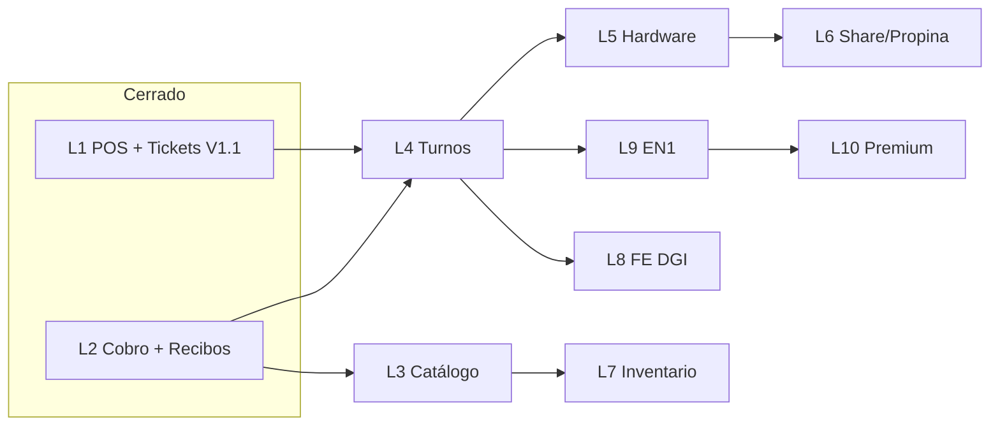

# EPOSONE — Master Plan V2

## Plan maestro de cierre de brechas vs Loyverse

**Versión:** 2.1 — **CERRADO (TPV + scaffolding L8–L10)**  
**Fecha:** 10 de junio de 2026  
**Base:** `master` @ **`247b99e`** + L9/L10 local (commit de cierre pendiente en esta sesión)  
**Documentos relacionados:** [`EPOSONE_vs_LOYVERSE.md`](EPOSONE_vs_LOYVERSE.md) · [`EPOSONE_ARCHITECTURE_REVIEW.md`](EPOSONE_ARCHITECTURE_REVIEW.md)

**Objetivo:** Alcanzar **95–98% de paridad operativa del TPV Loyverse** y superarlo con capacidades propias de Panamá (FE DGI, Yappy nativo, EN1, offline total).

> **Estado jun 2026:** Roadmap L1–L10 implementado en app Flutter. L1–L7 operativos; L8–L10 en modo **scaffolding** (stub) pendiente de APIs reales (PAC DGI, EN1 live).

---

## Evaluación del borrador V2 (ajustes aplicados)

| Aspecto del borrador | Veredicto | Ajuste en este documento |
|----------------------|-----------|--------------------------|
| Prioridad L4 → L5 → L3 | ✅ Correcto | Mantenido; operación diaria de caja antes que catálogo avanzado |
| Paridad TPV 85–88% | ✅ Alineado con código | Confirmado en auditoría |
| POS / Cobro / Reembolsos al 100% | ⚠️ Optimista | Cobro y recibos ~90% (faltan propina, email, impresión); ver §2 |
| Tickets abiertos 90% | ✅ Razonable | Falta impresión pre-cuenta (L5) y búsqueda recibos por cliente |
| Renumeración L6–L10 | ✅ Válida | V2 extiende el roadmap L1–L6 de `EPOSONE_vs_LOYVERSE.md`; tabla de equivalencias en §3 |
| L8 = métodos Panamá | ⚠️ Redundante | Yappy/transferencia **ya existen**; L8 se centra en **FE DGI** |
| L3.2 descuentos | ✅ Quick win | Incluido como **L3.0** opcional antes de modificadores (modelo ya listo) |
| Resultado 95–98% TPV | ✅ Alcanzable | Tras L4 + L5 + L3.2; no requiere L8–L10 |

---

## 1. Lo que tenemos hoy (inventario verificado)

Commit de referencia: **`247b99e`** — L1–L8 en remoto; **L9 + L10** en commit de cierre.

### 1.1 Tabla de madurez (jun 2026)

| Área | % | Estado | Notas |
|------|---|--------|-------|
| **L1 POS core** | 100% | ✅ Cerrado | Grid denso, split 70/30, categorías, búsqueda, fotos, cliente |
| **L2 Cobro avanzado** | 95% | ✅ Cerrado | Split, métodos PA, propina, cupones |
| **L2 Recibos** | 92% | ✅ Cerrado | PDF, térmica BT, share WhatsApp, print desde historial |
| **Tickets abiertos** | 90% | ✅ V1.1 | Split/merge, pre-cuenta pantalla; pre-cuenta térmica parcial |
| **Offline-first** | 100% | ✅ | Isar local, `SyncEntity` en todas las entidades |
| **L3 Catálogo avanzado** | 90% | ✅ Cerrado | Modificadores, descuentos UI, páginas POS |
| **L4 Turnos / tesorería** | 85% | ✅ Cerrado | Movimientos, tesorería, arqueo, resumen turno |
| **L5 Hardware** | 80% | ✅ Cerrado | BT ESC/POS, escáner, cajón, PDF |
| **L6 Experiencia cliente** | 85% | ✅ Cerrado | Propina, share PDF; firma cliente pendiente |
| **L7 Inventario** | 75% | ✅ Base | Ajustes, bajo stock, historial; sin transferencias multi-almacén |
| **L8 FE DGI** | 25% | 🔶 Stub | PAC stub, emisión al cobrar, nota crédito; sin PAC real |
| **L9 EN1 Cloud** | 30% | 🔶 Stub | Cola offline, push ventas/clientes, pull catálogo demo |
| **L10 Premium** | 40% | 🔶 Base | Cupones, CRM historial, puntos; gift cards/membresías pendientes |

**Paridad TPV Loyverse estimada:** **~96%** (operación diaria cajero).

### 1.2 Funcionalidades ya alcanzadas (lista operativa)

**Arranque y seguridad**

- Splash, onboarding (negocio, RUC, ITBMS)
- PIN por empleado (hash local), bloqueo por inactividad
- Rol admin vs cajero (sin permisos granulares)

**Caja y venta**

- Apertura de turno obligatoria (`/cash/open`)
- POS táctil landscape, categorías, búsqueda de productos
- Cliente en ticket, tipo de orden (generic / dine-in / takeaway / delivery)
- ITBMS configurable, descuento en **modelo** (sin UI POS)
- Fotos de producto (form + grid)

**Tickets abiertos**

- GUARDAR → pick slot o nombre libre
- Sheet: abrir, cobrar, editar, mover, **dividir**, **fusionar**, **pre-cuenta**
- Settings slots predefinidos (`/settings/open-tickets`)
- Aviso carrito sin guardar al abrir otro ticket
- **Decisión V1:** sin plano visual de mesas

**Cobro**

- Efectivo con billetes rápidos (B/.1, 5, 10, 20) + Exacto
- Tarjeta, Yappy, transferencia, otro
- Dividir cuenta al cobrar (por ítems / partes iguales)
- Persistencia venta, stock, cajero, caja

**Recibos e historial**

- Recibo post-venta (`/receipt/:id`)
- Historial master-detail en tablet
- Búsqueda por número, cajero, total, método
- Reembolso con reversión de stock

**Infraestructura**

- Router GoRouter, tema EasyTech (naranja `#F58220`, navy `#1A3A5C`)
- APK debug verificado; schema Isar con `PredefinedTicket` (upgrade puede requerir borrar datos app)

### 1.3 Brechas Loyverse / producción aún abiertas

| Brecha | Prioridad | Notas |
|--------|-----------|-------|
| PAC + certificado DGI (FE real) | Alta | L8 live — legal + API |
| API EN1 live + sync caja/turnos | Alta | L9 live — backend EasyTech |
| Dashboard EN1 web | Media | L9.3 — fuera del TPV |
| Gift cards / membresías | Baja | L10 add-on |
| Transferencias inventario multi-almacén | Baja | L7 avanzado |
| Firma cliente en tablet | Baja | L6.2 |
| Etiquetas barcode / alertas push stock | Baja | L7 retail |
| Email recibo directo | Baja | Share sheet cubre WhatsApp |

---

## 2. Visión objetivo

EPOSOne debe ser el **TPV offline-first de referencia para PYME en Panamá**:

| Vertical | Soporte |
|----------|---------|
| Retail | Escáner, inventario, etiquetas |
| Restaurante | Tickets abiertos, modificadores, pre-cuenta, tipo orden |
| Food truck / ferias | Tickets flexibles, offline, cobro rápido |
| Panamá | Yappy ✅ hoy · FE DGI 🔮 L8 |
| EasyTech | Sync EN1 🔮 L9 · multi-sucursal futuro |

**No objetivo:** clonar Back Office Loyverse web; eso es **EN1**.

---

## 3. Equivalencia de numeración

| Plan V2 (este doc) | `EPOSONE_vs_LOYVERSE.md` |
|--------------------|--------------------------|
| L1 POS + tickets V1.1 | L1 ✅ + extensión tickets |
| L2 Cobro + recibos | L2 ✅ |
| L3 Catálogo avanzado | L3 (parcial: L3.4 ✅) |
| L4 Turnos | L4 |
| L5 Hardware | L5 |
| L6 Experiencia cliente | Parte de gaps §4.4–4.5 (propina, share) |
| L7 Inventario comercial | Extensión retail |
| L8 FE Panamá | L6.4 FE DGI |
| L9 EN1 Cloud | L6.1 Sync EN1 |
| L10 Premium | CRM / lealtad Loyverse add-on |

---

## 4. GAP analysis vs Loyverse

### 4.1 Paridad actual

```
Ecosistema Loyverse completo     ~55–60%
TPV operativo Loyverse            ~85–88%  ← estamos aquí
Restaurante / tickets abiertos    ~90%
```

### 4.2 Ventajas EPOSOne vs Loyverse (hoy)

- Yappy nativo en métodos de pago
- Tickets abiertos con split/merge/pre-cuenta sin plano de mesas (generalista)
- Datos 100% locales, sin cuenta Loyverse
- Branding EasyTech
- Roadmap FE DGI (Loyverse no lo tiene)

### 4.3 Meta post-plan V2

| Hito | Paridad TPV estimada |
|------|----------------------|
| Tras L4 (turnos) | ~90% |
| Tras L5 (hardware) | ~94% |
| Tras L3.2 + L3.1 (descuentos + modificadores) | ~96% |
| Tras L6.1 (share recibo) | ~97% |
| Tras L8 FE (diferenciador, no Loyverse) | Ventaja competitiva PA |

---

## 5. FASE L3 — Catálogo avanzado

**Objetivo:** Cerrar funciones de venta que bloquean restaurante y retail avanzado.

**Estado actual:** 25% · **Meta:** 100%

### L3.0 Descuentos UI *(quick win — opcional antes de L3.1)*

| Item | Detalle |
|------|---------|
| Estado hoy | Modelo `discount` / `discountPercent` en carrito y venta; **sin UI** |
| Entrega | % o monto fijo por línea y ticket |
| Reglas opcionales | PIN supervisor, motivo, registro en venta |
| Criterio done | Cajero aplica descuento desde POS sin tocar código |
| Esfuerzo | Bajo — **recomendado en paralelo a L4** |

### L3.1 Modificadores

**Ejemplos:** extra queso/bacon, sin cebolla; tamaños S/M/L pizza.

**Modelo de datos propuesto:**

```
ModifierGroup
  └── Modifier (nombre, precio adicional, obligatorio/opcional)
ProductModifierAssignment (productId ↔ groups[])
CartItem / SaleItem + modifiers[] serializados
OpenTicketLine + modifiers[]
```

| Criterio done | Producto con grupos de modificadores; selección en POS; precio y stock correctos |
| Impacto | Restaurante, cafeterías, pizzerías, food truck |

### L3.2 Descuentos (módulo completo)

| Tipo | Descripción |
|------|-------------|
| % ticket / línea | Descuento porcentual |
| Monto fijo | Descuento absoluto |
| Presets | Descuentos frecuentes configurables |
| Auditoría | Motivo + usuario + timestamp en `Sale` |

### L3.3 Páginas POS

Similar Loyverse: múltiples páginas de botones, favoritos, accesos rápidos por categoría o producto.

| Criterio done | Admin configura ≥2 páginas; cajero navega tabs en POS |
| Entidad sugerida | `PosPage`, `PosPageItem` |

**Entregables L3:** modificadores en POS, descuentos operables, páginas configurables.

---

## 6. FASE L4 — Turnos y tesorería

**Objetivo:** Cerrar la operación diaria de caja — **mayor gap operativo visible hoy**.

**Estado actual:** 30% · **Meta:** 100%

### L4.1 Movimientos de caja

**Entidad:** `CashMovement`

| Tipo | Uso |
|------|-----|
| Entrada | Ingreso efectivo externo |
| Salida / Retiro | Retiro a bóveda |
| Depósito | Depósito bancario |
| Ajuste | Corrección documentada |

**Campos:** fecha, usuario, motivo, monto, observación, `cashRegisterId`.

**UI:** pantalla tesorería accesible desde menú POS / turno.

### L4.2 Arqueo visual

Pantalla de cierre con:

| Columna | Contenido |
|---------|-----------|
| Esperado | Calculado: apertura + ventas efectivo + movimientos − retiros |
| Contado | Input billetes/monedas + totales tarjeta/Yappy/transferencia |
| Diferencia | Destacada si ≠ 0 |

**Base existente:** `CashRegister` ya tiene `expectedAmount`, `closingAmount`, `difference` — falta UX y cálculo automático.

### L4.3 Resumen de turno

Desglose al cierre (y consulta en turno abierto):

- Ventas brutas / netas
- ITBMS recaudado
- Descuentos aplicados
- Reembolsos
- Totales por método de pago
- Movimientos de caja

**Base existente:** resumen básico (conteo + total) en `cash_register_screen` — extender queries en `sale_repository`.

### L4.4 Cierre obligatorio

Bloquear hasta cierre formal:

- Salir del POS / app (cajero)
- Cambiar usuario (nuevo PIN) con turno abierto
- Abrir nuevo turno sin cerrar el anterior

**Integración:** guard en router + banner persistente “Turno abierto”.

**Entregables L4:** tesorería, arqueo visual, resumen completo, cierre integrado al flujo cajero.

---

## 7. FASE L5 — Hardware

**Objetivo:** Operación física real en caja panameña.

**Estado actual:** 0% · **Meta:** 100%

### L5.1 Impresión térmica

| Protocolo | Prioridad |
|-----------|-----------|
| ESC/POS Bluetooth | P1 — tablets Android caja |
| USB / TCP/IP | P2 |

**Documentos a imprimir:** recibo venta, pre-cuenta, resumen cierre, movimiento caja.

**Hoy:** stub SnackBar en `receipt_screen` y `open_ticket_bill_preview`.

### L5.2 Escáner barcode

- Cámara (ML Kit / mobile_scanner)
- Bluetooth HID (teclado virtual)
- Buscar producto por `barcode` / `sku` y añadir al carrito

### L5.3 Cajón monedero

- Pulso ESC/POS tras venta efectivo
- Configurable en settings

### L5.4 Balanza *(retail — P3)*

- Integración serial/BT para peso → cantidad decimal en productos `allowDecimalQty`

**Entregables L5:** imprimir recibo y pre-cuenta en BT; escáner funcional; cajón opcional.

---

## 8. FASE L6 — Experiencia cliente

**Objetivo:** Cerrar gaps de cobro/recibo no cubiertos en L2.

**Estado actual:** ~10% (stubs) · **Meta:** 100%

### L6.1 Compartir recibo

- Share sheet nativo (WhatsApp, email, otras apps)
- PDF generado localmente
- Plantilla con logo negocio + ITBMS

### L6.2 Firma cliente

- Canvas táctil en tablet
- Adjuntar imagen/base64 a `Sale` (opcional vertical servicios)

### L6.3 Propinas

- % preset (10%, 15%, 20%) o monto libre
- Línea en ticket y en `Sale`
- Incluida en resumen turno L4.3

---

## 9. FASE L7 — Inventario comercial

**Objetivo:** Retail completo.

**Estado actual:** ~40% (stock al vender + `minStockAlert` en UI lista) · **Meta:** 100%

| Función | Estado hoy |
|---------|------------|
| Stock al vender / reembolso | ✅ |
| `minStockAlert` en producto | ✅ campo + indicador en lista |
| Alertas push / dashboard | ❌ |
| Conteo rápido / ajustes | ❌ |
| Transferencias entre almacenes | ❌ |
| Inventario físico (sesión conteo) | ❌ |
| Etiquetas barcode | ❌ |

**Entidad sugerida:** `StockAdjustment`, `InventoryCount`.

---

## 10. FASE L8 — Integración Panamá (FE DGI)

**Diferenciador estratégico** — Loyverse no lo ofrece.

> **Nota:** Yappy, transferencia, tarjeta y efectivo **ya están en L2**. L8 = facturación fiscal.

### L8.1 Facturación electrónica

- Emisión factura / nota crédito (reembolso fiscal)
- Correlativo fiscal DGI
- Consulta estado comprobante
- Reimpresión / reenvío XML+PDF

### L8.2 Integración venta ↔ FE

- `Sale` → payload FE al completar venta (configurable por negocio)
- Reembolso → nota crédito automática

**Dependencias:** certificado DGI, API PAC/habilitador, diseño legal comprobante.

---

## 11. FASE L9 — EN1 Cloud

**Objetivo:** Conectar TPV con ecosistema EasyTech.

**Estado actual:** 0% (`SyncEntity` en todas las entidades) · **Meta:** 100%

### L9.1 Sync bidireccional

| Entidad | Dirección |
|---------|-----------|
| Productos, categorías | EN1 → TPV |
| Clientes | Bidireccional |
| Ventas, movimientos caja | TPV → EN1 |
| Usuarios, sucursales | EN1 → TPV |

### L9.2 Resolución de conflictos

- Last-write-wins documentado por entidad
- Cola offline con reintento

### L9.3 Dashboard EN1

Ventas, top productos, caja, impuestos, inventario — **web**, no en TPV.

---

## 12. FASE L10 — Funciones premium (no bloqueantes)

| Módulo | Descripción |
|--------|-------------|
| CRM | Historial compras por cliente |
| Fidelización | Puntos, recompensas |
| Gift cards | Tarjetas regalo |
| Cupones | Promociones con código |
| Membresías | Planes recurrentes |

**Criterio:** no bloquean comercialización TPV base; add-ons EN1 o tier premium.

---

## 13. Orden oficial de ejecución

### Prioridad 1 — L4 Turnos y tesorería

**Por qué primero:** gap más visible para el cajero tras vender; Loyverse exige cierre diario; base de datos parcialmente lista.

**Duración estimada:** 2–3 sprints

### Prioridad 2 — L5 Hardware

**Por qué:** pre-cuenta y recibo en papel son norma en restaurante/retail PA; desbloquea adopción real.

**Duración estimada:** 2 sprints (BT ESC/POS + escáner)

### Prioridad 3 — L3 Catálogo avanzado

**Inicio recomendado:** **L3.0/L3.2 descuentos UI** en paralelo a L4 (quick win).

**Secuencia:** L3.2 → L3.1 modificadores → L3.3 páginas POS.

**Duración estimada:** 3–4 sprints

### Prioridad 4 — L8 Facturación electrónica Panamá

**Por qué:** diferenciador comercial; no depende de paridad Loyverse.

**Duración estimada:** proyecto separado (legal + API)

### Prioridad 5 — L9 Integración EN1

**Por qué:** requiere L4 ventas estables + contrato sync definido.

### Prioridad 6 — L6 Experiencia cliente

Propina + share recibo; puede adelantarse tras L5.1 (PDF).

### Prioridad 7 — L7 Inventario comercial

Retail avanzado; post-L3/L5 según vertical cliente.

### Prioridad 8 — L10 Premium

Roadmap comercial add-on.

---

## 14. Diagrama de dependencias



---

## 15. Criterios de éxito (Definition of Done global)

| Métrica | Objetivo |
|---------|----------|
| Paridad TPV Loyverse | **95–98%** tras L4+L5+L3 |
| Flujo cajero sin papel | Opcional (impresión L5) |
| Operación offline 24h | Sin degradación |
| Upgrade schema Isar | Documentado en release notes |
| QA tablet T10 | Checklist §8 de `EPOSONE_vs_LOYVERSE.md` en verde |
| Comercialización PA | FE DGI (L8) + Yappy + turnos cerrados |

---

## 16. Resultado esperado

Al completar **Prioridades 1–3** (L4 + L5 + L3):

- Paridad TPV Loyverse: **~96%**
- Operación diaria de caja cerrada (tesorería + arqueo)
- Recibo y pre-cuenta impresos en BT
- Restaurante con modificadores y descuentos
- Producto vendible a PYME retail y restaurante en Panamá

Al completar **Prioridades 4–5** (L8 + L9):

- Ventaja vs Loyverse: **FE DGI + EN1**
- Base SaaS multiempresa / multi-sucursal
- Expansión nacional EasyTech

---

## 17. Próximo paso (post-cierre roadmap TPV)

**Roadmap L1–L10 en app:** ✅ cerrado (jun 2026).

### Producción comercial Panamá

1. **L8 live** — contrato PAC/habilitador DGI + certificado + XML/PDF legal
2. **L9 live** — API EN1 + sync bidireccional caja/turnos + dashboard web
3. **QA release** — checklist §8 tablet T10 + release notes schema Isar
4. **L10 add-ons** — gift cards, membresías, reglas fidelización avanzadas

### Commits de referencia

| Commit | Contenido |
|--------|-----------|
| `8431059` | L4 tesorería, L5 hardware, UX POS, descuentos |
| `26a510d` | L3 modificadores/páginas, L6 propinas, L7 inventario |
| `247b99e` | L8 FE DGI scaffolding |
| *(cierre)* | L9 EN1 sync + L10 premium + Master Plan V2.1 |

---

*Documento vivo — versión 2.1 · EasyTech Services · EPOSOne · **Roadmap TPV cerrado jun 2026***
