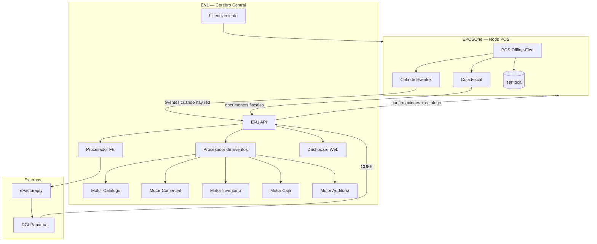
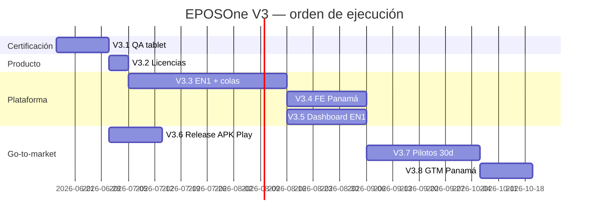

# EPOSONE — Master Plan V3

## Producto comercial · Plataforma Cloud EasyTech · Go-to-market Panamá

**Versión:** 3.3 — **ACTIVO**  
**Fecha:** 10 de julio de 2026  
**Base:** `master` @ **`2e5197f`** — Hito 1 provisioning cliente congelado  
**Contexto de app:** [`EPOSONE_APP_CONTEXT.md`](EPOSONE_APP_CONTEXT.md)  
**Integración EN1:** [`Doc/EPOSONE_EN1_INTEGRATION_LOG.md`](Doc/EPOSONE_EN1_INTEGRATION_LOG.md) · Contrato Hito 1: [`Doc/EPOSONE_EN1_HITO1_PROVISIONING_CONTRACT.md`](Doc/EPOSONE_EN1_HITO1_PROVISIONING_CONTRACT.md)  
**Documentos relacionados:** [`EPOSONE_MASTER_PLAN_V2.md`](EPOSONE_MASTER_PLAN_V2.md) · [`EPOSONE_vs_LOYVERSE.md`](EPOSONE_vs_LOYVERSE.md) · [`EPOSONE_ARCHITECTURE_REVIEW.md`](EPOSONE_ARCHITECTURE_REVIEW.md)

**Objetivo:** Convertir EPOSOne de TPV funcional (~96% paridad Loyverse) en **producto comercial vendible** en Panamá, como **app independiente** del ecosistema EasyNodeOne.

> **Producto:** EPosOne = aplicación POS · EasyNodeOne = plataforma. **Una sola APK.** Modos Local / Plataforma / Vincular EN1 — no “tres productos”.

> **POS Core Protegido:** ventas, caja, cobro, tickets, productos, impresión y UX del cajero **no se modifican** salvo bugs. Toda evolución (Onboarding, Device, Sync, EN1) vive en `features/platform/`.

> **Principio rector:** EN1 es el cerebro; EPosOne es un nodo operativo. Los POS **nunca** se comunican entre sí. Sync por **eventos**. Nunca bloquear una venta por falta de internet.

> **Hito 1 (Provisioning) — lado EPosOne: CERRADO / CONGELADO** (`2e5197f`). Integración real cuando EN1 publique las APIs del contrato v0.1.

---

## 0. Punto de partida (post-V2)

| Dimensión | Estado jul 2026 |
|-----------|-----------------|
| Roadmap V2 L1–L10 (app Flutter) | ✅ Cerrado |
| Paridad TPV Loyverse (operación cajero) | ~**96%** |
| Producto comercial listo para vender | ~**65%** |
| L8 FE DGI | 🔶 Stub (PAC simulado) |
| L9 EN1 Cloud | 🔶 Stub (cola offline demo) |
| L10 Premium | 🔶 Base (cupones, puntos, CRM historial) |
| APK release | ✅ `1.0.0+1` — `epos1.apk` (firma debug, pilotos) |
| Catálogo demo Istmo | ✅ ~110 productos, 11 categorías, páginas Comida/Bar |
| Imágenes producto (ItsBrew) | ✅ 73 assets; 110/110 con imagen en TPV |
| QA V3.1 en curso | 🔶 Checklist parcial (restaurante Istmo) |
| Hito 1 Provisioning (cliente APK) | ✅ **Cerrado / congelado** (`2e5197f`) |
| APIs EN1 register/config | 🟡 Pendiente CODITO |
| Integración Hito 1 punta a punta | 🔴 No probada |
| Sync inteligente (Hito 2) | ❌ Stub — no iniciar hasta validar Hito 1 |

**Lo que falta no son más pantallas de TPV.** Falta que EN1 publique provisioning, integrar tablet limpia, luego sync (Hito 2), QA y piloto. Ver [`EPOSONE_APP_CONTEXT.md`](EPOSONE_APP_CONTEXT.md).

### 0.1 Avance sprint Istmo (commit `db1433a`)

Trabajo completado y pusheado a `master`:

| Entrega | Detalle |
|---------|---------|
| **Catálogo Istmo** | Menú real PDF: ~110 productos, precios ITBMS incluido, SKUs `IST-*`, seed automático |
| **Imágenes ItsBrew** | 73 JPG en `assets/catalog/istmo/`; mapeo producto→imagen; instalación local al abrir |
| **Páginas POS** | Comida (5 categorías) + Bar (6 categorías); modificadores cervezas Istmo y salsas wings |
| **Onboarding negocio** | Defaults Istmo: `taxIncluded`, sin inventario, orden `dineIn` |
| **QA fixes** | Recuperar tickets guardados; nav categorías; tickets abiertos visibles en móvil |
| **UX ventas** | Chips de categoría horizontales antes del buscador (filtro rápido por categoría) |
| **APK piloto** | `eposone/epos1.apk` — build local, no versionado en git |

**Pendiente QA formal:** checklist V3.1 firmado con hallazgos en `Doc/` (local).

### 0.2 Hito 1 — Provisioning cliente EPosOne (cerrado / congelado)

Commits: `b42f642` (cliente) · `2e5197f` (contrato completo + errores UX + store versionado).

| Entrega | Detalle |
|---------|---------|
| **Wizard** | Crear negocio **o** Conectar EasyNodeOne |
| **Conectar EN1** | URL + código → `POST /api/v1/devices/register` |
| **Contrato v0.1** | Request/response, HTTP 200/4xx/5xx, formato `error`, ejemplos JSON |
| **Persistencia** | Token + IDs jerarquía; `schemaVersion` + gancho `migrateIfNeeded` |
| **Errores UX** | Sin red, timeout, servidor, código inválido, no autorizado + log técnico |
| **Skip wizard** | Si ya provisionado → onboarding/PIN |
| **Renovación token** | ⏸ Diferida — define EN1 primero |
| **Sync catálogo/ventas** | Stub (Hito 2) |
| **Core** | 🔒 Sin cambios en `features/pos/` |

**Documentos:** [`Doc/EPOSONE_EN1_HITO1_PROVISIONING_CONTRACT.md`](Doc/EPOSONE_EN1_HITO1_PROVISIONING_CONTRACT.md) · [`Doc/EPOSONE_EN1_INTEGRATION_LOG.md`](Doc/EPOSONE_EN1_INTEGRATION_LOG.md)

**Siguiente:** EN1 publica APIs → prueba tablet limpia → ✅ integración Hito 1 → recién entonces Hito 2 (sync).

---

## 1. Visión V3 — EN1 como cerebro, EPosOne como nodo

### 1.1 Principio arquitectónico

```
                    EN1
            (Back Office Central)

        Empresas · Sucursales · Usuarios
        Catálogo · Inventario · Clientes
        Precios · Promociones · Impuestos
        Pedidos · Facturación · Compras
        Reportes · APIs · IA · Analítica
                    ▲
                    │
             Sincronización
              (solo eventos)
                    │
    ┌───────────────┼───────────────┐
    │               │               │
    ▼               ▼               ▼

  POS 1           POS 2           POS 3
  Offline         Offline         Offline
```

| Regla | Descripción |
|-------|-------------|
| **EN1 = cerebro** | Toda la inteligencia de negocio vive en EN1 |
| **EPosOne = nodo** | Cada tablet es un terminal operativo autónomo |
| **Sin P2P** | Los POS **nunca** hablan entre sí |
| **Sin bloqueo** | Nunca bloquear una venta por falta de internet |
| **Eventos, no tablas** | No sincronizar tablas completas; sincronizar **eventos** de dominio |

### 1.2 Qué almacena cada POS (mínimo operativo)

Solo lo necesario para **seguir vendiendo sin Internet**:

| Dominio | Datos locales |
|---------|---------------|
| **Catálogo** | Productos, categorías, variantes, precios, impuestos |
| **Comercial** | Promociones vigentes, clientes frecuentes (opcional) |
| **Seguridad** | Usuarios autorizados |
| **Operación** | Pedidos, pagos, caja, aperturas, cierres, reembolsos |
| **Trazabilidad** | Auditoría local, cola de eventos pendientes |

**Nada más.** Sin inventario global, sin analítica, sin multi-sucursal en el dispositivo.

### 1.3 Qué vive únicamente en EN1

| Dominio | Contenido |
|---------|-----------|
| **Empresa** | Empresas, sucursales, cajeros, meseros, vendedores, roles |
| **Comercial** | Clientes, créditos, cuentas por cobrar, pedidos globales |
| **Fiscal** | Facturación electrónica, cola PAC, CUFE, estados DGI |
| **Inventario** | Stock central, compras, traslados, ajustes globales |
| **Analítica** | Dashboard, reportes, KPIs, IA |
| **Plataforma** | Licenciamiento, APIs, sincronización, bitácora central |

### 1.4 Identidad operativa (obligatoria antes de vender)

Cada operación debe conocer **cinco niveles**. No se vende sin ellos:

```
Empresa → Sucursal → POS → Caja → Turno
```

### 1.5 El pedido como centro del sistema

```
Pedido → Items → Pagos → Factura → Entrega
```

**Estados del pedido** (configurables por vertical; no todos los negocios usan todos):

```
BORRADOR → ABIERTO → EN_PREPARACION → LISTO → ENTREGADO → COBRADO → FACTURADO → CERRADO
```

### 1.6 Modelo de sincronización por eventos

**No sincronizar tablas. Sincronizar eventos.**

Ejemplo:

```json
{
  "event": "pedido_creado",
  "device": "POS-03",
  "empresa": 1,
  "sucursal": 2,
  "pedido": 5487
}
```

Eventos de dominio esperados: `pedido_creado`, `pedido_actualizado`, `producto_agregado`, `pago_realizado`, `factura_emitida`, `inventario_movimiento`, `caja_apertura`, `caja_cierre`, etc.

**Flujo offline:**

```
Pedido → SQLite (Isar) → Cola local → [sin red: espera]
                                    → [con red: API EN1] → Confirmado → Marcado sincronizado
```

### 1.7 Conflictos y propiedad de pedidos

| Regla | Comportamiento |
|-------|----------------|
| **Un propietario por pedido** | Cada pedido tiene un POS dueño; solo ese POS puede modificarlo |
| **Consulta cross-POS** | Otro POS puede **consultar** o **solicitar transferencia**, no editar |
| **Pago en otra caja** | Ej. Mesa 12 atendida por Pedro, cliente paga en Caja 2: `Transferir a Caja` → Caja 2 cobra → pedido sigue siendo de Pedro (cambia cajero, no vendedor) |
| **Sin edición concurrente** | Nunca permitir editar el mismo pedido desde dos POS |

### 1.8 Inventario en el nodo POS

El POS **no calcula inventario global**. Solo:

```
Venta → Stock local (descuento) → Evento → EN1 → Stock central
```

Si EN1 detecta diferencias → genera ajuste → notifica / sincroniza hacia POS.

### 1.9 Motores de sincronización independientes

No un único proceso monolítico. **Motores separados:**

| Motor | Responsabilidad |
|-------|-----------------|
| **Catálogo** | Productos, precios, impuestos, promociones |
| **Comercial** | Pedidos, facturas, clientes, pagos |
| **Inventario** | Movimientos, ajustes, transferencias |
| **Caja** | Aperturas, cierres, arqueos |
| **Auditoría** | Eventos, errores, reintentos, bitácora |

Cada motor tiene su cola, reintentos y política de confirmación EN1.

### 1.10 Diagrama técnico (visión consolidada)



**Regla principal:** Nunca bloquear una venta por falta de internet.

---

## 2. Roadmap V3 — Fases

| Fase | Nombre | Duración | Dependencias |
|------|--------|----------|--------------|
| **V3.1** | Certificación operativa | 1–2 semanas | APK release |
| **V3.2** | Arquitectura comercial | 3–5 días | V3.1 |
| **V3.3** | Plataforma Cloud EasyTech | 4–8 semanas | V3.2 |
| **V3.4** | Facturación electrónica Panamá | Sobre V3.3 | V3.3 etapa fiscal |
| **V3.5** | Dashboard EN1 | Paralelo / dentro V3.3 | V3.3 API |
| **V3.6** | Release comercial | 1–2 semanas | V3.1 verde |
| **V3.7** | Pilotos | 30 días | V3.3 + V3.6 |
| **V3.8** | Lanzamiento Panamá | Continuo | V3.7 |
| **V3.9** | Roadmap 2027 | Post-clientes activos | V3.8 |

---

## 3. V3.1 — Certificación operativa

**Duración:** 1–2 semanas  
**Objetivo:** Validar que el sistema resiste operación real.

### Casos obligatorios

| Vertical | Enfoque |
|----------|---------|
| Restaurante | Tickets abiertos, modificadores, split, pre-cuenta |
| Retail | Escáner, inventario, reembolsos |
| Food truck | Offline prolongado, cobro rápido |
| Barbería | Servicios, cliente, turnos |
| Transversal | Sin internet, reinicio inesperado, reembolso, turnos |

### Pruebas mínimas

- Venta continua (≥4 h)
- Reembolsos con reversión stock
- Apertura / cierre turno + arqueo
- Impresión térmica + PDF + share
- Escáner barcode
- Inventario (ajuste + bajo stock)
- Tickets abiertos (guardar, split, merge, cobrar)
- Apagado inesperado mid-venta / mid-turno
- Operación 8 h sin internet

### Resultado

- Checklist **100% firmado**
- **Cero bugs críticos** abiertos
- Release notes schema Isar documentadas

---

## 4. V3.2 — Arquitectura comercial y decisiones EN1

**Duración:** 3–5 días  
**Objetivo:** Definir oficialmente tres productos sobre la misma app Flutter **y cerrar las decisiones de arquitectura EN1↔POS** antes de implementar sincronización.

### EPOSOne Local

| Atributo | Valor |
|----------|-------|
| Modelo | Pago único |
| Conectividad | Offline total |
| FE | Diferida manual / batch |
| Nube | Sin EN1 |
| Backup | Responsabilidad del cliente |
| Sync | Sin cola de eventos (o export manual) |

### EPOSOne Cloud

| Atributo | Valor |
|----------|-------|
| Modelo | Suscripción mensual |
| Conectividad | Eventos cuando hay red |
| FE | Automática vía EN1 → eFacturapty |
| Nube | EN1 (backup, dashboard) |
| Backup | EN1 |
| Sync | Cola de eventos + motores independientes |

### EPOSOne Business

| Atributo | Valor |
|----------|-------|
| Modelo | Suscripción premium |
| Alcance | Multi-sucursal |
| Extra | Analítica avanzada EN1 |
| FE | Automática por sucursal |
| Sync | Eventos multi-sucursal; EN1 consolida |

### Entregables técnicos

- `BusinessConfig` definitivo: flags `licenseTier`, `en1SyncEnabled`, `fiscalMode`, `empresaId`, `sucursalId`, `posId`, `cajaId`, tokens
- UI activación de licencia (Local / Cloud / Business)
- Documento comercial de precios alineado con flags
- **ADR (Architecture Decision Record):** modelo eventos vs tablas — **eventos aprobado**
- Esquema de eventos v1 (JSON schema + catálogo de tipos)
- Política de propiedad de pedidos y transferencia entre cajas

### Preguntas abiertas — resolver ANTES de V3.3

Estas decisiones bloquean el diseño de sincronización. Deben quedar respondidas en V3.2:

| # | Pregunta | Impacto |
|---|----------|---------|
| 1 | ¿El pedido nace **siempre** en EPosOne o también puede crearse en EN1? | Origen de eventos, permisos back-office |
| 2 | ¿La FE la genera el POS o EN1 emite el documento fiscal tras el evento `pago_realizado`? | Cola fiscal, responsabilidad legal |
| 3 | ¿El inventario se reserva al **crear** el pedido o solo al **facturar**? | Stock local vs central, restaurantes vs retail |
| 4 | ¿Las promociones se calculan íntegramente en el POS o EN1 puede recalcular al sincronizar? | Consistencia comercial, conflictos |
| 5 | ¿Un pedido puede iniciarse en un POS y terminarse en otro, o queda bloqueado al dispositivo creador? | Movilidad, transferencias, propiedad |

**Recomendación:** Resolver estas cinco preguntas primero. A partir de ellas se diseña una sincronización robusta para restaurantes, tiendas, supermercados y ferreterías **sin rehacer arquitectura**.

**Resultado:** Una app, tres modos de licencia. EN1 como cerebro event-driven. Sin fork de código.

---

## 5. V3.3 — Plataforma Cloud EasyTech

**Duración:** 4–8 semanas  
**Objetivo:** EN1 deja de ser stub. EPOSOne emite eventos; EN1 procesa y confirma. **Sin comunicación POS↔POS.**

> **Este es el proyecto unificado** que reemplaza la secuencia anterior “FE diferida → EN1 live”. Incluye cola fiscal, cola de eventos, API EN1, motores de sync, integración eFacturapty, dashboard y licenciamiento.

### Componentes de plataforma

```
Plataforma Cloud EasyTech (V3.3)
├── Cola de Eventos   ← Eventos de dominio (reemplaza sync por tablas)
├── Cola Fiscal       ← FiscalDocument pending + reintentos
├── EN1 API           ← Backend real (staging + producción)
├── Procesador Eventos← Routing a motores independientes
├── Motores Sync      ← Catálogo · Comercial · Inventario · Caja · Auditoría
├── eFacturapty       ← Habilitador FE Panamá
├── Dashboard         ← Web EN1 (V3.5, no Flutter)
└── Licenciamiento    ← Local / Cloud / Business
```

### Sincronización — modelo por eventos (no tablas)

| Motor | Eventos ejemplo | Dirección principal |
|-------|-----------------|---------------------|
| **Catálogo** | `producto_actualizado`, `precio_cambiado`, `promocion_vigente` | EN1 → POS |
| **Comercial** | `pedido_creado`, `pago_realizado`, `factura_emitida` | POS → EN1 |
| **Inventario** | `movimiento_stock`, `ajuste_aplicado` | POS → EN1; ajustes EN1 → POS |
| **Caja** | `caja_apertura`, `caja_cierre`, `arqueo_registrado` | POS → EN1 |
| **Auditoría** | `evento_error`, `reintento_sync` | Bidireccional |

**Etapas de implementación:**

| Etapa | Alcance | Criterio de done |
|-------|---------|------------------|
| **1ª** | Motor Catálogo + identidad POS (empresa/sucursal/POS/caja/turno) | Catálogo EN1 baja a tablet; eventos de confirmación |
| **2ª** | Motor Comercial + Caja (pedidos, pagos, turnos) | Venta offline → evento → EN1 confirma en staging |
| **3ª** | Motor Inventario + Fiscal (FE, CUFE, estados DGI) | CUFE real en piloto |

### App Flutter (adaptaciones sobre scaffolding L8/L9)

- `SyncOperation` → evolucionar a **cola de eventos** tipada (mantener compatibilidad transitoria)
- Reintentos automáticos por motor (hasta N intentos) + confirmación idempotente EN1
- Desacoplar cobro de emisión fiscal: venta siempre completa; FE en cola separada
- Banner POS: eventos pendientes + documentos fiscales pendientes
- Adapter live `En1ApiAdapter` (reemplaza stub)
- Validar identidad operativa antes de cada venta (empresa → turno)
- Propiedad de pedido + flujo transferencia entre cajas

### Backend EN1 (nuevo / extendido)

- API REST autenticada por sucursal/token/dispositivo
- **Procesador de eventos** con routing a motores
- Cola de procesamiento FE (post-evento `pago_realizado` o según ADR V3.2)
- Integración eFacturapty (certificado, XML, CUFE)
- Proyecciones de lectura (ventas, clientes, catálogo, turnos) — EN1 materializa desde eventos
- Webhook / poll para devolver confirmaciones y CUFE a tablets
- **Prohibido:** API que permita sync directo POS↔POS

**Resultado:** EPOSOne + EN1 operan como plataforma híbrida offline-first, event-driven, con cloud real.

---

## 6. V3.4 — Facturación electrónica Panamá

**Duración:** Dentro del proyecto V3.3 (etapa 3ª)  
**Objetivo:** FE legal sobre infraestructura EN1 ya desplegada.

### Flujo

```
Venta (siempre completa, offline OK)
    ↓
FiscalDocument → status: Pending
    ↓
Fiscal Queue (local Isar)
    ↓  [cuando hay internet]
EN1 API
    ↓
eFacturapty
    ↓
DGI
    ↓
CUFE + estado (accepted / rejected)
    ↓
Sync → Tablet (actualiza FiscalDocument local)
```

### Reglas

1. **Nunca bloquear una venta** por falta de internet o fallo FE.
2. Correlativo fiscal local reservado al cobrar; CUFE llega async.
3. Nota de crédito al reembolsar → misma cola.
4. Reintento manual + automático desde historial FE.
5. Modo Local: FE batch/manual; Modo Cloud: FE automática vía EN1.

### Pendiente legal / proveedor

- Contrato PAC / habilitador (eFacturapty)
- Certificado DGI del contribuyente
- XML/PDF legal según normativa vigente

---

## 7. V3.5 — Dashboard EN1

**Regla:** No Flutter. No duplicar lógica en el TPV.

Todo el back-office y BI vive en **EN1 web**.

### Indicadores mínimos

| Módulo | Métricas |
|--------|----------|
| Ventas | Totales, por método, por cajero, por período |
| Caja | Turnos abiertos/cerrados, arqueos, diferencias |
| Inventario | Stock, bajo stock, movimientos |
| FE | Pendientes, aceptadas, rechazadas, CUFE |
| Productos | Top vendidos, categorías |

### TPV solo expone

- Link / deep link a dashboard EN1 (modo Cloud/Business)
- Datos bien formateados vía sync V3.3

---

## 8. V3.6 — Release comercial

**Objetivo:** Producto instalable y publicable.

### APK producción

| Item | Detalle |
|------|---------|
| Package | Definitivo (salir de `com.example.eposone`) |
| Keystore | Producción (no debug) |
| Versionado | Semver + build number |
| Canal | Beta interna → Play Store |

### Google Play

- Cuenta desarrollador
- Política de privacidad
- Capturas tablet landscape
- Banner / ficha comercial

### Landing comercial

- Beneficios Local vs Cloud vs Business
- Precios
- Capturas y videos demo
- Descarga / contacto ventas

**Dependencia:** V3.1 checklist verde antes de Play Store público.

---

## 9. V3.7 — Pilotos

**Duración:** 30 días  
**Objetivo:** Primeros clientes reales.

### Verticales (mínimo 3 clientes)

| Vertical | Tipo |
|----------|------|
| Restaurante | Cloud recomendado |
| Retail | Local o Cloud |
| Servicios | Barbería / similar |

### Medir

- Bugs (críticos / medios / bajos)
- Rendimiento (latencia POS, sync, FE)
- Necesidades reales no previstas
- Adopción cajero (curva aprendizaje)

**Resultado:** Go/no-go para V3.8 con datos reales.

---

## 10. V3.8 — Lanzamiento Panamá

### Planes comerciales

| Plan | Público |
|------|---------|
| **EPOSOne Local** | PYME offline, pago único |
| **EPOSOne Cloud** | PYME con backup + FE automática |
| **EPOSOne Business** | Multi-sucursal + analítica |

### Entregables GTM

- Soporte (canal WhatsApp / ticket)
- Documentación usuario
- Videos cortos por vertical
- Manual cajero + manual admin
- Material ventas EasyTech

---

## 11. V3.9 — Roadmap 2027

**Regla:** Solo después de clientes activos y revenue. **Prohibido desarrollar antes de validar mercado.**

| Feature | Notas |
|---------|-------|
| Gift cards | Add-on EN1 |
| Membresías | Add-on EN1 |
| Fidelización avanzada | Reglas, tiers, canje |
| CRM avanzado | Campañas, segmentación |
| Multi-almacén | Transferencias entre bodegas |
| Multi-sucursal avanzada | Consolidado, permisos granulares |

> Cupones, puntos básicos y CRM historial **ya existen** (L10 base). Suficientes para pilotos V3.7.

---

## 12. Inventario V2 completado (referencia)

| Fase V2 | Estado | % |
|---------|--------|---|
| L1 POS + tickets | ✅ | 100% |
| L2 Cobro / recibos | ✅ | 95% |
| L3 Catálogo avanzado | ✅ | 90% |
| L4 Turnos / tesorería | ✅ | 85% |
| L5 Hardware | ✅ | 80% |
| L6 Experiencia cliente | ✅ | 85% |
| L7 Inventario | ✅ | 75% |
| L8 FE DGI | 🔶 Stub | 25% |
| L9 EN1 Cloud | 🔶 Stub | 30% |
| L10 Premium | 🔶 Base | 40% |

**Commit de referencia V2:** `895ae1a`

---

## 13. Matriz de responsabilidades

| Componente | Equipo | Fase |
|------------|--------|------|
| QA tablet + checklist | App / QA | V3.1 |
| Licencias BusinessConfig | App + Producto | V3.2 |
| EN1 API backend | Backend EasyTech | V3.3 |
| Cola fiscal + sync app | App Flutter | V3.3 |
| eFacturapty integración | Backend + Legal | V3.3 / V3.4 |
| Dashboard web | Backend / Web EN1 | V3.5 |
| Keystore + Play Store | App + DevOps | V3.6 |
| Pilotos + soporte | Producto + Ventas | V3.7 |
| GTM Panamá | Marketing + Ventas | V3.8 |

---

## 14. Criterios de éxito V3

| Métrica | Objetivo |
|---------|----------|
| Checklist V3.1 | 100% pass, 0 bugs críticos |
| Catálogo Istmo piloto | 110 productos + imágenes en TPV |
| Venta offline 8 h | Sin pérdida de datos |
| Cola FE | 0 ventas bloqueadas por red |
| Cola eventos EN1 etapa 1 | Catálogo + identidad POS en staging |
| Cola eventos EN1 etapa 2 | Pedidos + pagos confirmados en EN1 |
| FE etapa 3 | CUFE real en ≥1 venta piloto |
| ADR V3.2 | 5 preguntas arquitectura respondidas |
| Pilotos V3.7 | ≥3 negocios, 30 días, 0 críticos abiertos |
| Play Store | APK firmado en beta o producción |

---

## 15. Orden de ejecución recomendado



**Sprint inmediato:** EN1 publica APIs Hito 1 → integración tablet limpia · EPosOne cliente **congelado** · no iniciar Hito 2 sync hasta validar provisioning · V3.1 QA Istmo en paralelo.

---

## 16. POS Core Protegido (jul 2026)

**Decisión de producto:** el flujo operativo del cajero es **Core Protegido**.

### No tocar (salvo bugs / mejoras puntuales)

Ventas · Abrir caja · Cobrar · Tickets · Reembolsos · Productos · Clientes · Inventario básico · Impresión · Bluetooth · UX del cajero.

Si hoy puede vender, mañana debe vender **exactamente igual**.

### Extender (módulos nuevos alrededor del Core)

```
lib/src/features/platform/
  onboarding / device / sync / provisioning / EN1 connector / LicensePolicy
```

Una sola APK. Modos: **Local** · **Plataforma** · **Vincular EN1**.  
El cajero no debe sentir que está “dentro del ERP”.

### Entregado — Hito 1 Provisioning (EPosOne cerrado / congelado)

| Módulo | Estado |
|--------|--------|
| Wizard Bienvenido + Conectar EN1 | ✅ |
| Cliente API register/config (contrato v0.1) | ✅ |
| Persistencia token + IDs + `schemaVersion` | ✅ |
| Errores UX + log técnico | ✅ |
| Sync catálogo/ventas | 🔶 Stub (Hito 2) |
| Renovación de token | ⏸ Define EN1 |
| POS Core | 🔒 Sin cambios |

### Siguiente (sin tocar Core)

1. **Integración Hito 1:** EN1 APIs live + tablet limpia registrada automáticamente  
2. **Hito 2:** sync fino catálogo/clientes (solo tras ✅ Hito 1)  
3. Vincular negocio Local → EN1 sin reinstalar  

---

## 17. Commits de referencia

| Commit | Contenido |
|--------|-----------|
| `895ae1a` | Cierre V2: L9 EN1 stub + L10 premium |
| `074668a` | Master Plan V3.0 — roadmap comercial |
| `db1433a` | Catálogo Istmo, imágenes ItsBrew, chips categoría POS, QA fixes |
| `b42f642` | Hito 1: cliente provisioning + Core Protegido |
| `2e5197f` | Hito 1: contrato completo, errores UX, store versionado — **congelado** |

---

*Documento vivo — versión 3.3 · EasyTech Services · EPOSOne · **Roadmap comercial activo jul 2026***  
*Contexto de app:* [`EPOSONE_APP_CONTEXT.md`](EPOSONE_APP_CONTEXT.md) · *Bitácora integración:* [`Doc/EPOSONE_EN1_INTEGRATION_LOG.md`](Doc/EPOSONE_EN1_INTEGRATION_LOG.md)
