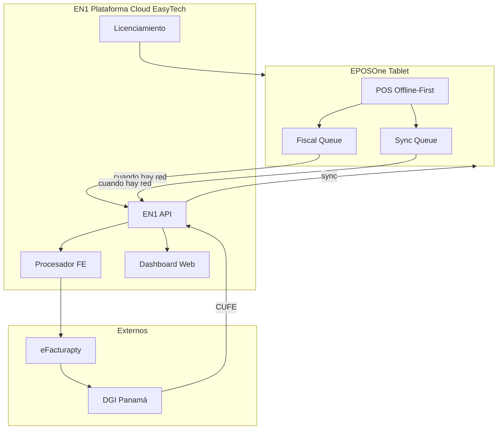
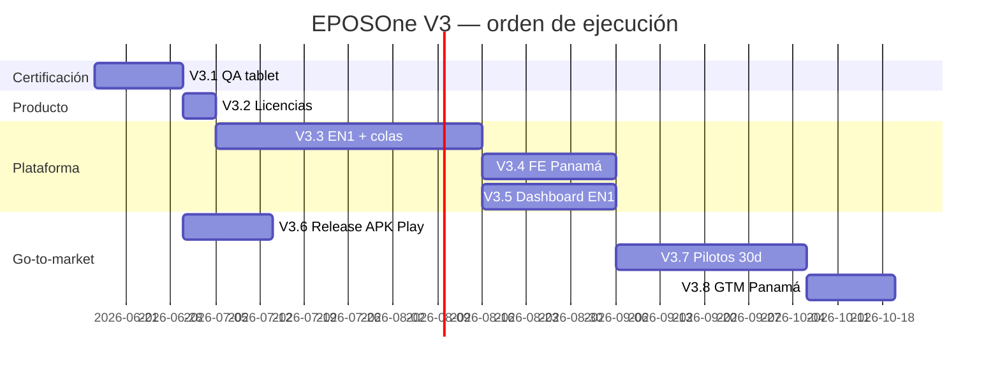

# EPOSONE — Master Plan V3

## Producto comercial · Plataforma Cloud EasyTech · Go-to-market Panamá

**Versión:** 3.0 — **ACTIVO**  
**Fecha:** 14 de junio de 2026  
**Base:** `master` @ **`895ae1a`** — Roadmap V2 (L1–L10 TPV) cerrado  
**Documentos relacionados:** [`EPOSONE_MASTER_PLAN_V2.md`](EPOSONE_MASTER_PLAN_V2.md) · [`EPOSONE_vs_LOYVERSE.md`](EPOSONE_vs_LOYVERSE.md) · [`EPOSONE_ARCHITECTURE_REVIEW.md`](EPOSONE_ARCHITECTURE_REVIEW.md)

**Objetivo:** Convertir EPOSOne de TPV funcional (~96% paridad Loyverse) en **producto comercial vendible** en Panamá, con EN1 como centro de la plataforma cloud.

> **Decisión arquitectónica clave:** V3.3 (Plataforma Cloud) y V3.4 (FE Panamá) **no son proyectos separados en serie**. La FE diferida **depende de EN1**. EN1 es el hub: cola fiscal, cola sync, API, eFacturapty, dashboard y licenciamiento viven en un solo proyecto de plataforma.

---

## 0. Punto de partida (post-V2)

| Dimensión | Estado jun 2026 |
|-----------|-----------------|
| Roadmap V2 L1–L10 (app Flutter) | ✅ Cerrado |
| Paridad TPV Loyverse (operación cajero) | ~**96%** |
| Producto comercial listo para vender | ~**60%** |
| L8 FE DGI | 🔶 Stub (PAC simulado) |
| L9 EN1 Cloud | 🔶 Stub (cola offline demo) |
| L10 Premium | 🔶 Base (cupones, puntos, CRM historial) |
| APK release | ✅ `1.0.0+1` (firma debug, pilotos) |

**Lo que falta no son más pantallas de TPV.** Falta certificación, plataforma cloud real, FE legal, release comercial y pilotos.

---

## 1. Visión V3 — EN1 como centro



**Regla principal:** Nunca bloquear una venta por falta de internet.

---

## 2. Roadmap V3 — Fases

| Fase | Nombre | Duración | Dependencias |
|------|--------|----------|--------------|
| **V3.1** | Certificación operativa | 1–2 semanas | APK release |
| **V3.2** | Arquitectura comercial | 3–5 días | V3.1 |
| **V3.3** | Plataforma Cloud EasyTech | 4–8 semanas | V3.2 |
| **V3.4** | Facturación electrónica Panamá | Sobre V3.3 | V3.3 etapa fiscal |
| **V3.5** | Dashboard EN1 | Paralelo / dentro V3.3 | V3.3 API |
| **V3.6** | Release comercial | 1–2 semanas | V3.1 verde |
| **V3.7** | Pilotos | 30 días | V3.3 + V3.6 |
| **V3.8** | Lanzamiento Panamá | Continuo | V3.7 |
| **V3.9** | Roadmap 2027 | Post-clientes activos | V3.8 |

---

## 3. V3.1 — Certificación operativa

**Duración:** 1–2 semanas  
**Objetivo:** Validar que el sistema resiste operación real.

### Casos obligatorios

| Vertical | Enfoque |
|----------|---------|
| Restaurante | Tickets abiertos, modificadores, split, pre-cuenta |
| Retail | Escáner, inventario, reembolsos |
| Food truck | Offline prolongado, cobro rápido |
| Barbería | Servicios, cliente, turnos |
| Transversal | Sin internet, reinicio inesperado, reembolso, turnos |

### Pruebas mínimas

- Venta continua (≥4 h)
- Reembolsos con reversión stock
- Apertura / cierre turno + arqueo
- Impresión térmica + PDF + share
- Escáner barcode
- Inventario (ajuste + bajo stock)
- Tickets abiertos (guardar, split, merge, cobrar)
- Apagado inesperado mid-venta / mid-turno
- Operación 8 h sin internet

### Resultado

- Checklist **100% firmado**
- **Cero bugs críticos** abiertos
- Release notes schema Isar documentadas

---

## 4. V3.2 — Arquitectura comercial

**Duración:** 3–5 días  
**Objetivo:** Definir oficialmente tres productos sobre la misma app Flutter.

### EPOSOne Local

| Atributo | Valor |
|----------|-------|
| Modelo | Pago único |
| Conectividad | Offline total |
| FE | Diferida manual / batch |
| Nube | Sin EN1 |
| Backup | Responsabilidad del cliente |

### EPOSOne Cloud

| Atributo | Valor |
|----------|-------|
| Modelo | Suscripción mensual |
| Conectividad | Sync cuando hay red |
| FE | Automática vía EN1 → eFacturapty |
| Nube | EN1 (backup, dashboard) |
| Backup | EN1 |

### EPOSOne Business

| Atributo | Valor |
|----------|-------|
| Modelo | Suscripción premium |
| Alcance | Multi-sucursal |
| Extra | Analítica avanzada EN1 |
| FE | Automática por sucursal |

### Entregables técnicos

- `BusinessConfig` definitivo: flags `licenseTier`, `en1SyncEnabled`, `fiscalMode`, sucursal, tokens
- UI activación de licencia (Local / Cloud / Business)
- Documento comercial de precios alineado con flags

**Resultado:** Una app, tres modos de licencia. Sin fork de código.

---

## 5. V3.3 — Plataforma Cloud EasyTech

**Duración:** 4–8 semanas  
**Objetivo:** EN1 deja de ser stub. EPOSOne deja de depender únicamente de Isar para operaciones cloud.

> **Este es el proyecto unificado** que reemplaza la secuencia anterior “FE diferida → EN1 live”. Incluye cola fiscal, cola sync, API EN1, integración eFacturapty, dashboard y licenciamiento.

### Componentes de plataforma

```
Plataforma Cloud EasyTech (V3.3)
├── Cola Fiscal      ← FiscalDocument pending + reintentos
├── Cola Sync        ← SyncOperation universal (ya existe en app)
├── EN1 API          ← Backend real (staging + producción)
├── eFacturapty      ← Habilitador FE Panamá
├── Dashboard        ← Web EN1 (V3.5, no Flutter)
└── Licenciamiento   ← Local / Cloud / Business
```

### Sincronización — etapas

| Etapa | Entidades | Dirección |
|-------|-----------|-----------|
| **1ª** | Productos, categorías, clientes, ventas | TPV ↔ EN1 |
| **2ª** | Inventario, caja, turnos | TPV ↔ EN1 |
| **3ª** | Fiscal (FiscalDocument, CUFE, estados DGI) | TPV → EN1 → eFacturapty → DGI → TPV |

### App Flutter (adaptaciones sobre scaffolding L8/L9)

- `SyncOperation`: extender kinds (cashMovement, cashRegister, fiscalDocument, inventory)
- Reintentos automáticos (hasta N intentos) + last-write-wins catálogo
- Desacoplar cobro de emisión fiscal: venta siempre completa; FE en cola
- Banner POS: pendientes sync + pendientes FE
- Adapter live `En1ApiAdapter` (reemplaza stub)

### Backend EN1 (nuevo / extendido)

- API REST autenticada por sucursal/token
- Cola de procesamiento FE
- Integración eFacturapty (certificado, XML, CUFE)
- Almacenamiento cloud (ventas, clientes, catálogo, turnos)
- Webhook / poll para devolver CUFE a tablets

**Resultado:** EPOSOne + EN1 operan como plataforma híbrida offline-first con cloud real.

---

## 6. V3.4 — Facturación electrónica Panamá

**Duración:** Dentro del proyecto V3.3 (etapa 3ª)  
**Objetivo:** FE legal sobre infraestructura EN1 ya desplegada.

### Flujo

```
Venta (siempre completa, offline OK)
    ↓
FiscalDocument → status: Pending
    ↓
Fiscal Queue (local Isar)
    ↓  [cuando hay internet]
EN1 API
    ↓
eFacturapty
    ↓
DGI
    ↓
CUFE + estado (accepted / rejected)
    ↓
Sync → Tablet (actualiza FiscalDocument local)
```

### Reglas

1. **Nunca bloquear una venta** por falta de internet o fallo FE.
2. Correlativo fiscal local reservado al cobrar; CUFE llega async.
3. Nota de crédito al reembolsar → misma cola.
4. Reintento manual + automático desde historial FE.
5. Modo Local: FE batch/manual; Modo Cloud: FE automática vía EN1.

### Pendiente legal / proveedor

- Contrato PAC / habilitador (eFacturapty)
- Certificado DGI del contribuyente
- XML/PDF legal según normativa vigente

---

## 7. V3.5 — Dashboard EN1

**Regla:** No Flutter. No duplicar lógica en el TPV.

Todo el back-office y BI vive en **EN1 web**.

### Indicadores mínimos

| Módulo | Métricas |
|--------|----------|
| Ventas | Totales, por método, por cajero, por período |
| Caja | Turnos abiertos/cerrados, arqueos, diferencias |
| Inventario | Stock, bajo stock, movimientos |
| FE | Pendientes, aceptadas, rechazadas, CUFE |
| Productos | Top vendidos, categorías |

### TPV solo expone

- Link / deep link a dashboard EN1 (modo Cloud/Business)
- Datos bien formateados vía sync V3.3

---

## 8. V3.6 — Release comercial

**Objetivo:** Producto instalable y publicable.

### APK producción

| Item | Detalle |
|------|---------|
| Package | Definitivo (salir de `com.example.eposone`) |
| Keystore | Producción (no debug) |
| Versionado | Semver + build number |
| Canal | Beta interna → Play Store |

### Google Play

- Cuenta desarrollador
- Política de privacidad
- Capturas tablet landscape
- Banner / ficha comercial

### Landing comercial

- Beneficios Local vs Cloud vs Business
- Precios
- Capturas y videos demo
- Descarga / contacto ventas

**Dependencia:** V3.1 checklist verde antes de Play Store público.

---

## 9. V3.7 — Pilotos

**Duración:** 30 días  
**Objetivo:** Primeros clientes reales.

### Verticales (mínimo 3 clientes)

| Vertical | Tipo |
|----------|------|
| Restaurante | Cloud recomendado |
| Retail | Local o Cloud |
| Servicios | Barbería / similar |

### Medir

- Bugs (críticos / medios / bajos)
- Rendimiento (latencia POS, sync, FE)
- Necesidades reales no previstas
- Adopción cajero (curva aprendizaje)

**Resultado:** Go/no-go para V3.8 con datos reales.

---

## 10. V3.8 — Lanzamiento Panamá

### Planes comerciales

| Plan | Público |
|------|---------|
| **EPOSOne Local** | PYME offline, pago único |
| **EPOSOne Cloud** | PYME con backup + FE automática |
| **EPOSOne Business** | Multi-sucursal + analítica |

### Entregables GTM

- Soporte (canal WhatsApp / ticket)
- Documentación usuario
- Videos cortos por vertical
- Manual cajero + manual admin
- Material ventas EasyTech

---

## 11. V3.9 — Roadmap 2027

**Regla:** Solo después de clientes activos y revenue. **Prohibido desarrollar antes de validar mercado.**

| Feature | Notas |
|---------|-------|
| Gift cards | Add-on EN1 |
| Membresías | Add-on EN1 |
| Fidelización avanzada | Reglas, tiers, canje |
| CRM avanzado | Campañas, segmentación |
| Multi-almacén | Transferencias entre bodegas |
| Multi-sucursal avanzada | Consolidado, permisos granulares |

> Cupones, puntos básicos y CRM historial **ya existen** (L10 base). Suficientes para pilotos V3.7.

---

## 12. Inventario V2 completado (referencia)

| Fase V2 | Estado | % |
|---------|--------|---|
| L1 POS + tickets | ✅ | 100% |
| L2 Cobro / recibos | ✅ | 95% |
| L3 Catálogo avanzado | ✅ | 90% |
| L4 Turnos / tesorería | ✅ | 85% |
| L5 Hardware | ✅ | 80% |
| L6 Experiencia cliente | ✅ | 85% |
| L7 Inventario | ✅ | 75% |
| L8 FE DGI | 🔶 Stub | 25% |
| L9 EN1 Cloud | 🔶 Stub | 30% |
| L10 Premium | 🔶 Base | 40% |

**Commit de referencia V2:** `895ae1a`

---

## 13. Matriz de responsabilidades

| Componente | Equipo | Fase |
|------------|--------|------|
| QA tablet + checklist | App / QA | V3.1 |
| Licencias BusinessConfig | App + Producto | V3.2 |
| EN1 API backend | Backend EasyTech | V3.3 |
| Cola fiscal + sync app | App Flutter | V3.3 |
| eFacturapty integración | Backend + Legal | V3.3 / V3.4 |
| Dashboard web | Backend / Web EN1 | V3.5 |
| Keystore + Play Store | App + DevOps | V3.6 |
| Pilotos + soporte | Producto + Ventas | V3.7 |
| GTM Panamá | Marketing + Ventas | V3.8 |

---

## 14. Criterios de éxito V3

| Métrica | Objetivo |
|---------|----------|
| Checklist V3.1 | 100% pass, 0 bugs críticos |
| Venta offline 8 h | Sin pérdida de datos |
| Cola FE | 0 ventas bloqueadas por red |
| Sync EN1 etapa 1 | Productos + clientes + ventas en staging |
| FE etapa 3 | CUFE real en ≥1 venta piloto |
| Pilotos V3.7 | ≥3 negocios, 30 días, 0 críticos abiertos |
| Play Store | APK firmado en beta o producción |

---

## 15. Orden de ejecución recomendado



**Sprint inmediato:** solo V3.1.

---

## 16. Commits de referencia

| Commit | Contenido |
|--------|-----------|
| `895ae1a` | Cierre V2: L9 EN1 stub + L10 premium |
| `a55a059` | Master Plan V2.1 |
| *(V3)* | Master Plan V3.0 — roadmap comercial |

---

*Documento vivo — versión 3.0 · EasyTech Services · EPOSOne · **Roadmap comercial activo jun 2026***
